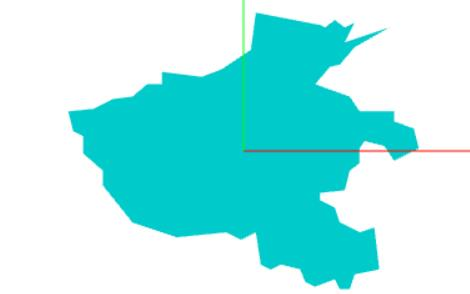

# 地图案例(包围盒、正投影)

## 概述

+ 地图案例会涉及到几何体、包围盒、正投影相机三方面知识点

  + 平面填充几何体 `ShapeGeometry`
  + 包围盒 `Box3`
  + 正投影相机 `OrthographicCamera`

## ShapeGeometry渲染河南省地图轮廓

+ 代码

  ```js
  const data = [// 河南边界轮廓边界经纬度坐标
    [110.3906, 34.585],
    [110.8301, 34.6289],
    ...
    ...
    [111.7969, 35.0684]
  ]
  const pointsArr = [];// 一组二维向量表示一个多边形轮廓坐标
  data.forEach(function(e){
    // data坐标数据转化为Vector2构成的顶点数组
    const v2 = new THREE.Vector2(e[0],e[1])
    pointsArr.push(v2);
  })
  // Shape表示一个平面多边形轮廓,参数是二维向量构成的数组pointsArr
  const shape = new THREE.Shape(pointsArr);

  // 多边形shape轮廓作为ShapeGeometry参数，生成一个多边形平面几何体
  const geometry = new THREE.ShapeGeometry(shape);
  ```

  

## 选择相机

+ 地图案例可以不使用透视投影相机模拟人眼的透视观察效果，选择正投影相机即可

  ```js
  // 正投影相机
  const width = window.innerWidth; //canvas画布宽度
  const height = window.innerHeight; //canvas画布高度
  const k = width / height; //canvas画布宽高比
  const s = 50; //控制left, right, top, bottom范围大小
  const camera = new THREE.OrthographicCamera(-s *k, s* k, s, -s, 1, 8000);
  camera.position.set(300, 300, 300);
  camera.lookAt(0, 0, 0); //指向坐标原点
  ```

+ 使用上面相机参数，默认情况下，你运行案例源码，可以看到河南地图并没有居中显示，在canvas画布上显示的效果也比较小

+ 如果你想地图全屏最大化居中显示，可以通过包围盒来辅助设置计算参数

## 包围盒Box3计算模型的中心位置和尺寸

+ 包围盒Box3计算模型的中心位置和尺寸

  ```js
  // 包围盒计算模型对象的大小和位置
  const box3 = new THREE.Box3();
  box3.expandByObject(mesh); // 计算模型包围盒
  const size = new THREE.Vector3();
  box3.getSize(size); // 计算包围盒尺寸
  // console.log('模型包围盒尺寸',size);
  const center = new THREE.Vector3();
  box3.getCenter(center); // 计算包围盒中心坐标
  // console.log('模型中心坐标',center);
  ```

## 地图居中显示

+ 设置相机 `.lookAt()` 参数指向包围盒几何中心即可

  ```js
  const x = 113.51,y = 33.88;
  camera.lookAt(x, y, 0);
  ```

+ 注意如果使用了 `OrbitControls` ，需要设置 `.target` 和 `.lookAt()` 参数是相同坐标

  ```js
  const controls = new OrbitControls(camera, renderer.domElement);
  controls.target.set(x, y, 0); //与lookAt参数保持一致
  controls.update();//update()函数内会执行camera.lookAt(controls.target)
  ```

## 地图基本填充cnavas画布

+ 地图显示效果更大，尽量使地图基本填充整个canvas画布。

+ 把正投影相机控制上下左右的变量s，设置为地图模型整体尺寸的一半左右即可

  ```js
  // const s = 50; //控制left, right, top, bottom范围大小
  const s = 2.5;//根据包围盒大小调整s，包围盒y方向尺寸的一半左右
  const camera = new THREE.OrthographicCamera(-s *k, s* k, s, -s, 1, 8000);
  ```

## 地图平行于canvas画布

+ 把相机的位置和观察目标的xy坐标设置为一样，这样相机的视线方向就垂直地图平面，这样地图就平行于canvas画布，或者说平行于显示器屏幕

  ```js
  const x = 113.51,y = 33.88;
  //与观察点x、y一样，地图平行与canvas画布
  camera.position.set(x, y, 300);
  camera.lookAt(x, y, 0);
  ```
