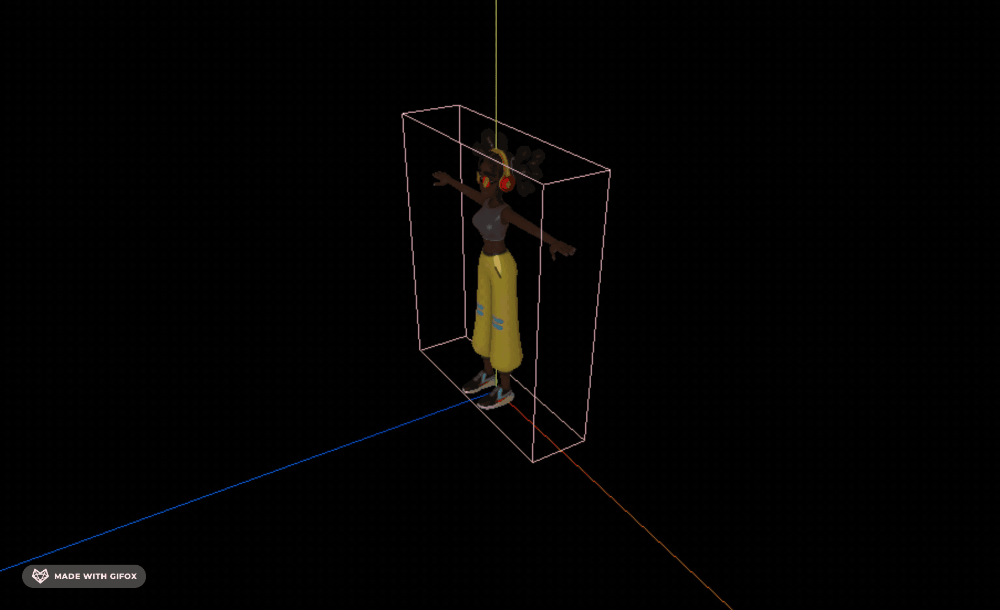

# Box3Helper

## 概述

+ 模拟3维包围盒 Box3 的辅助对象

  ```js
  const box = new THREE.Box3();
  box.setFromCenterAndSize( new THREE.Vector3( 1, 1, 1 ), new THREE.Vector3( 2, 1, 3 ) );

  const helper = new THREE.Box3Helper( box, 0xffff00 );
  scene.add( helper );
  ```

## 构造函数

+ `Box3Helper( box : Box3, color : Color )`

  + box -- 被模拟的3维包围盒.
  + color -- (可选的) 线框盒子的颜色. 默认为 0xffff00

+ 创建一个新的线框盒子用以表示指定的3维包围盒

  ```js
  const helper = new THREE.BoxHelper(gltf.scene, 'pink');
  mesh.add(helper);
  ```

  
