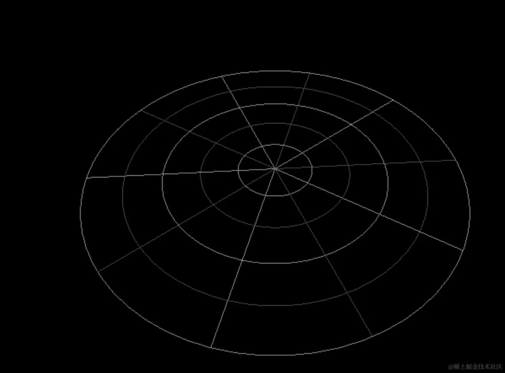
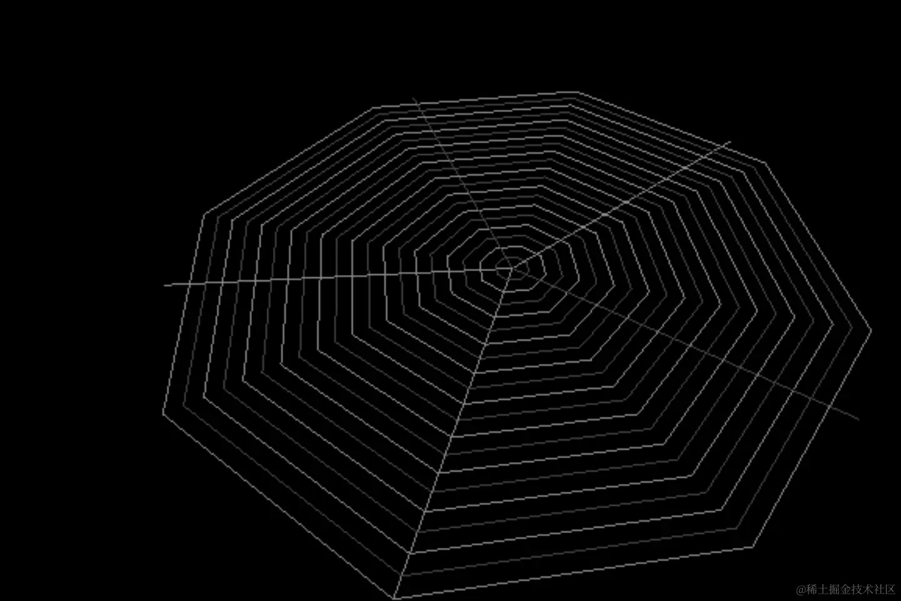

# PolarGridHelper 极坐标格辅助对象

## 概述

+ 标识角度

  ```js
  const radius = 10;
  const sectors = 16;
  const rings = 8;
  const divisions = 64;

  const helper = new THREE.PolarGridHelper( radius, sectors, rings, divisions );
  scene.add( helper );
  ```

## 构造函数

+ `PolarGridHelper( radius : Number, sectors : Number, rings : Number, divisions : Number, color1 : Color, color2 : Color )`

  + radius -- 极坐标格半径. 可以为任何正数. 默认为 10.
  + sectors -- 画多少直线. 默认 16.
  + rings -- 画多少圆圈. 默认 8.
  + divisions -- 圆圈细分段数. 可以为任何大于或等于3的正整数. 默认为 64.
  + color1 -- 极坐标格使用的第一个颜色. 值可以为 Color 类型, 16进制 和 CSS 颜色名. 默认为 0x444444
  + color2 -- 极坐标格使用的第二个颜色. 值可以为 Color 类型, 16进制 和 CSS 颜色名. 默认为 0x888888

  ```js
  const helper = new THREE.PolarGridHelper( 500, 10, 5, 64 );
  scene.add( helper );
  ```

    

  ```js
  // 修改下参数
  const helper = new THREE.PolarGridHelper( 500, 5, 20, 8 );
  ```

    
