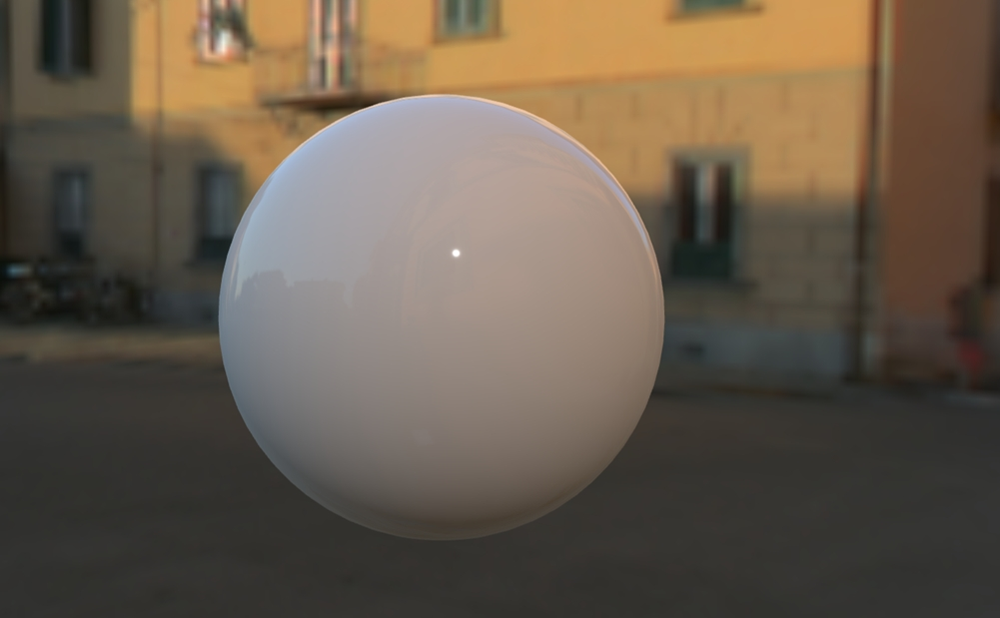

# 光照探针 LightProbe

## 概述

+ 用于捕捉和模拟环境光的影响。它通过对场景进行采样来获取周围环境的光照信息，并将这些信息应用于物体，从而模拟出更真实的光照效果
+ THREE.LightProbe 特别适用于需要反映环境光照变化的场景，比如室内环境、室外环境或动态光照条件下的场景

  

## 构造函数

+ 构造函数 new THREE.LightProbe() 不接受任何参数，创建一个空的光探针对象
+ 光探针需要通过更新其周围的光照信息来发挥作用

  ```js
  // 创建一个光探针
  var lightProbe = new THREE.LightProbe();
  lightProbe.position.set(0, 1, 0); // 设置光探针的位置
  scene.add(lightProbe);
  ```

## 方法之 update 更新光探针的光照信息

+ update() - 更新光探针的光照信息
+ 这个方法应该在每帧渲染之前被调用，以确保光探针能够及时反映场景中的光照变化

## 使用场景
光探针通常用于以下场景：

  + 环境光照模拟：模拟物体周围的环境光照，使物体看起来更加自然和真实
  + 动态光照：在动态光照条件下，光探针可以帮助物体更好地反映环境的变化
  + 室内环境：在室内环境中，光探针可以帮助捕捉和模拟墙壁、天花板和其他物体对光照的影响
  + 室外环境：在室外环境中，光探针可以帮助模拟天空、树木和其他自然元素对光照的影响

## 注意事项

+ 性能考虑：使用光探针会增加渲染开销，尤其是在高分辨率网格和大影响范围的情况下。因此，在性能敏感的应用中，需要权衡光照质量和渲染性能
+ 光照模型：光探针在不同的光照模型中可能表现不同。例如，THREE.MeshStandardMaterial 和 THREE.MeshPhysicalMaterial 等现代材质支持物理正确的光照模型，会更真实地处理环境光照的影响
+ 更新频率：为了保持光照效果的实时性，需要在每一帧渲染之前调用 update() 方法来更新光探针的光照信息

## 示例

+ code

  ```js
  // 创建场景
  var scene = new THREE.Scene();

  // 创建相机
  var camera = new THREE.PerspectiveCamera(75, window.innerWidth / window.innerHeight, 0.1, 1000);
  camera.position.z = 5;

  // 创建渲染器
  var renderer = new THREE.WebGLRenderer();
  renderer.setSize(window.innerWidth, window.innerHeight);
  document.body.appendChild(renderer.domElement);

  // 创建光探针
  var lightProbe = new THREE.LightProbe();
  lightProbe.position.set(0, 1, 0); // 设置光探针的位置
  scene.add(lightProbe);

  // 创建一个立方体
  var geometry = new THREE.BoxGeometry(1, 1, 1);
  var material = new THREE.MeshStandardMaterial({ color: 0x00ff00, envMap: scene.environment });
  var cube = new THREE.Mesh(geometry, material);
  scene.add(cube);

  // 创建一个环境贴图
  var environmentTextureLoader = new THREE.TextureLoader();
  var environmentTexture = environmentTextureLoader.load('path/to/environment_texture.hdr');
  environmentTexture.mapping = THREE.EquirectangularReflectionMapping;
  scene.environment = environmentTexture;

  // 渲染函数
  function animate() {
    requestAnimationFrame(animate);

    // 更新光探针 可以确保光探针能够及时反映场景中的光照变化
    lightProbe.update();

    // 旋转立方体
    cube.rotation.x += 0.01;
    cube.rotation.y += 0.01;

    renderer.render(scene, camera);
  }
  animate();
  ```
