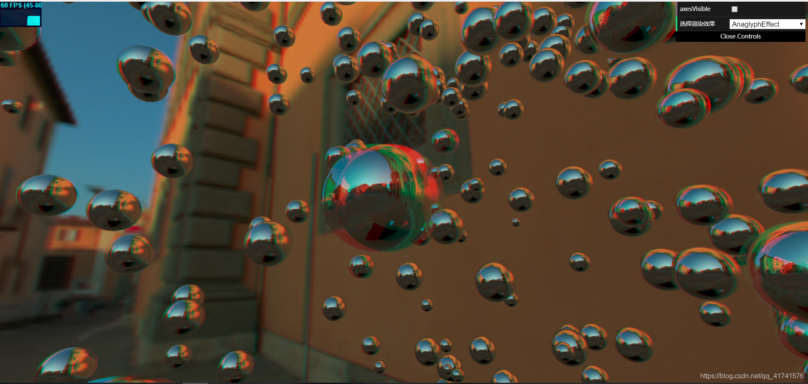

# AnaglyphEffect 立体浮雕渲染效果 - 插件

## 概述

+ 实现立体浮雕渲染效果

  

## 基本使用

+ code

  ```js
  import { AnaglyphEffect } from "examples/jsm/effects/AnaglyphEffect.js"

  //必须使用普通渲染方式
  renderer=new THREE.WebGLRenderer({
    antialias:true
  });

  //再添加效果
  var width=window.innerWidth || 2;
  var height=window.innerHeight || 2;
  effect=new THREE.AnaglyphEffect(renderer);
  effect.setSize(width,height);

  function render(){
    //renderer.render(scene,camera);
    effect.render(scene,camera);//该渲染基于renderer
  }
  ```
