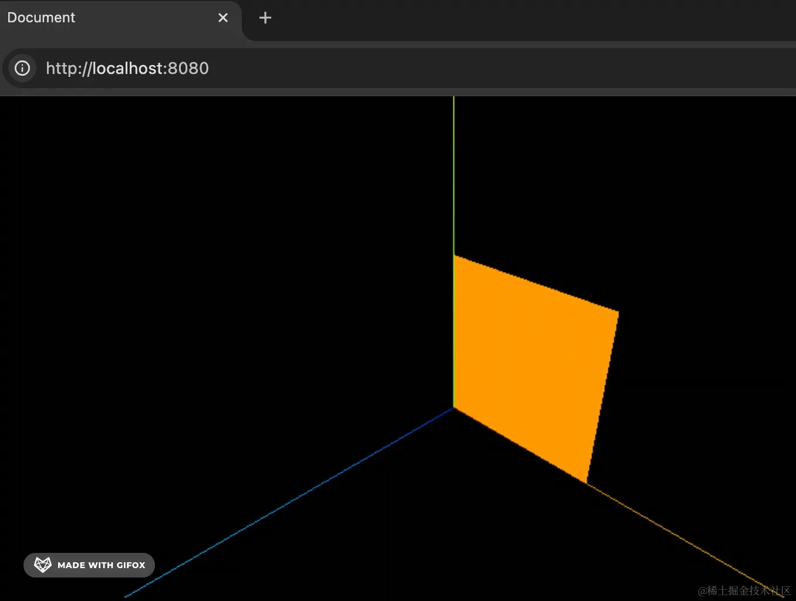

# position

## position 概述

+ position ：定义顶点位置，可以实现任意形状

+ three.js提供的矩形平面PlaneGeometry、长方体BoxGeometry、球体SphereGeometry等各种形状的几何体，他们都有一个共同的父类BufferGeometry

## 分段

+ 先分段，然后再内部画三角形

  ```js
  import * as THREE from 'three';

  // 矩形平面是先水平分了 2 段，竖直分了 3 段
  const geometry = new THREE.PlaneGeometry(100, 100, 2, 3);

  const material = new THREE.MeshBasicMaterial(({
    color: new THREE.Color('orange'),
    wireframe: true
  }));

  const mesh = new THREE.Mesh(geometry, material);

  console.log(mesh);

  export default mesh;
  ```

  
  

+ 顶点 `geometry.attributes.position` 是 12，也就是 12 个不重复的顶点

  

+ 顶点索引

  

## 查看几何体顶点位置和索引数据

+ 可以用顶点索引index数据构建几何体，也可以不用，threejs默认的大部分几何体都有三角形的顶点索引数据，具体可以通过浏览器控制台打印几何体数据查看

  ```js
  const geometry = new THREE.PlaneGeometry(100,50); //矩形平面几何体

  // const geometry = new THREE.BoxGeometry(50,50,50); //长方体

  console.log('几何体',geometry);
  console.log('顶点位置数据',geometry.attributes.position);
  console.log('顶点索引数据',geometry.index);
  ```

  

## 修改 顶点位置

+ 顶点会按照 3 个一组来分组， `position.count` 是分组数，可以通过 `setX、setY、setZ` 修改某个分组的 xyz 值

  ```js
  // 创建几何体 长10段 宽10段
  const geometry = new THREE.PlaneGeometry(300, 300, 10, 10);

  // 随机顶点坐标
  const position = geometry.attributes.position;
  // console.log(position);
  for (let i = 0; i < position.count; i++) {
    position.setZ(i, Math.random() * 50);
  }

  const material = new THREE.MeshBasicMaterial({
    color: new THREE.Color("orange"),
    wireframe: true,
  });

  const mesh = new THREE.Mesh(geometry, material);
  ```
