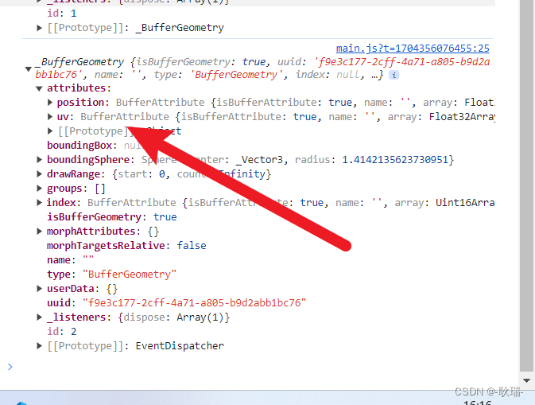

# 顶点法线数据 normal

## 概述

+ 法向量是垂直于三维模型表面某一点的单位向量，用于描述该点的朝向=
+ 在光照模型中，法向量决定了光线与表面的夹角，直接影响漫反射和高光强度

  + 用于根据光线与物体表面入射角，计算得到反射角(光从哪个角度反射出去)

  

+ 在Threejs中表示物体的网格模型Mesh的曲面是由一个一个三角形构成，所以为了表示物体表面各个位置的法线方向，可以给几何体的每个顶点定义一个方向向量，通过属性 `geometry.attributes.normal` 设置

  + 顶点法线(法向量)数据 `geometry.attributes.normal`

+ 一个三角面只会有一个法向量。一个顶点会属于不同的三角面，因此一个顶点会有多个法向量
+ 红色短线表示顶点法向量，绿色短线表示面法向量

  

+ Three.js中法线和数学中法线概念相似，只是定义的时候更灵活，会根据需要进行调整

## 作用

+ 光照计算

  + 在光照模型（如 Phong 照明模型）中，法向量与光源方向向量共同决定物体表面的漫反射光强度
  + 通过计算法向量与光源方向向量的点积，可以得到光照的漫反射分量。例如，当法向量与光源方向向量同向时，说明物体表面正对着光源，漫反射光最强；当两者垂直时，漫反射光较弱，甚至几乎没有，使物体表面呈现出不同的明暗程度，从而营造出逼真的光照效果，让物体在场景中有立体感。同时，法向量也参与镜面反射光的计算，影响高光的生成位置和强度，使得物体表面具有光泽感，更贴近真实材质的光照表现

+ 阴影生成

  + 包括面的朝向判断，根据法向量的方向，可以判断面的朝向。在渲染过程中，Three.js 会根据面法向量的方向来决定是否显示该面
  + 如果一个面的法向量背向摄像机，通常情况下这个面会被认为是背面，Three.js 默认不渲染背面（可以通过设置 material.side 来改变这一行为），这样可以提高渲染效率，避免渲染不可见的面，减少不必要的计算和图形绘制操作

+ 视差效果

  + 法线贴图是一种纹理贴图，它存储了相对于模型表面切线空间的法向量信息
  + 与普通颜色纹理不同，法线贴图中的每个像素代表一个法向量
  + 这些法向量会 “扰动” 模型表面原本的法向量，让原本平滑的表面看起来像是有细微的凹凸不平，从而在光照计算时产生更复杂的阴影和高光效果，模拟出精细的表面细节

+ 基于法向量的碰撞检测（简单情况）

  + 在一些简单的三维场景中，可以利用法向量来进行碰撞检测的初步判断
  + 例如，当一个球体接近一个平面时，可以通过比较球心到平面的距离与球体半径的关系，以及球心与平面的相对位置与平面法向量的方向来判断是否发生碰撞
  + 如果球心到平面的距离小于球体半径，并且球心在平面的法向量指向的一侧，那么可以认为发生了碰撞，进而触发相应的碰撞响应操作，如反弹、停止移动等

## 法向量设置

+ 方式1：几何体自动生成法向量

  + 对于内置几何体（如 BoxGeometry、SphereGeometry），Three.js 会自动计算法向量

    ```js
    const geometry = new THREE.SphereGeometry(5, 32, 32);
    geometry.computeVertexNormals(); // 自动计算顶点法线
    ```

+ 方式2 自定义法向量:对于自定义几何体（如 BufferGeometry），需手动指定法线数组

  ```js
  const geometry = new THREE.BufferGeometry();
  const vertices = new Float32Array([...]); // 顶点坐标
  const normals = new Float32Array([...]);  // 每个顶点对应的法向量

  geometry.setAttribute('position', new THREE.BufferAttribute(vertices, 3));
  geometry.setAttribute('normal', new THREE.BufferAttribute(normals, 3));
  ```

## 面法线 vs 顶点法线

+ 面法线（Face Normal） ：每个三角形面片的统一法线，适用于平面物体
+ 顶点法线（Vertex Normal） ：每个顶点的独立法线，通过插值实现平滑过渡

## 示例

+ 用来做光反射

  ```js
  // MeshBasicMaterial不受光照影响
  // 使用受光照影响的材质，几何体Geometry需要定义顶点法线数据
  const material = new THREE.MeshLambertMaterial({
    color: 0x0000ff,
    side: THREE.DoubleSide, //两面可见
  });

  // 如果更换成 MeshLambertMaterial 材质 则无法显示，因为受光照影响的材质，几何体BufferGeometry需要定义顶点法线数据
  ```

+ 通过 PlaneGeometry 创建的几何体 它是自带法向量

  

+ 自己创建的这个平面 它是没有的

  
