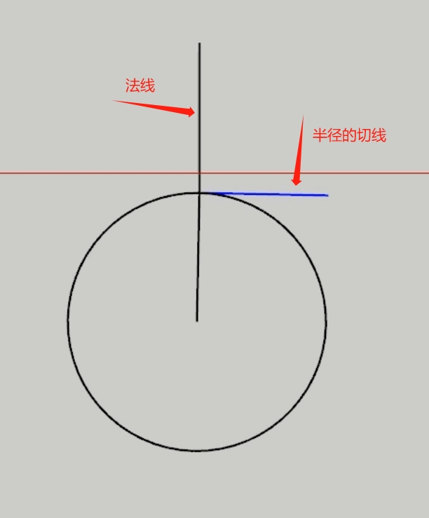
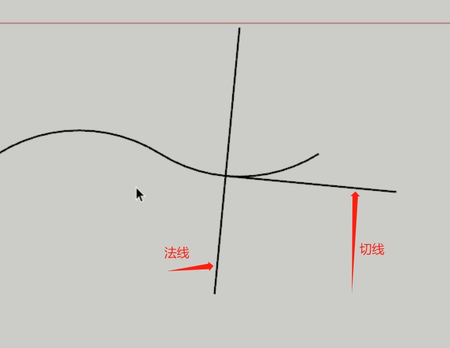
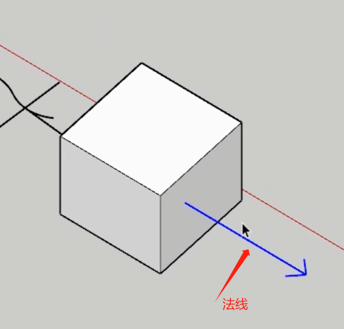
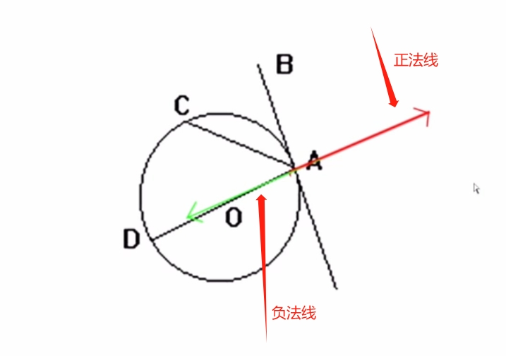

# 法线

## 概述

+ 垂直于某平面的直线（几何学），过入射点垂直于镜面的直线（光学）

## 平面的法线

+ 法线（normal line），是指始终垂直于某平面的直线

  

## 曲线的法线

+ 曲线的法线是垂直于曲线上一点的切线的直线
+ 曲面上某一点的法线指的是经过这一点并且与该点切平面垂直的那条直线（即向量）

  

## 立体体

+ 对于立体表面而言，法线是有方向的：一般来说，由立体的内部指向外部的是法线正方向，反过来的是法线负方向

  
  
