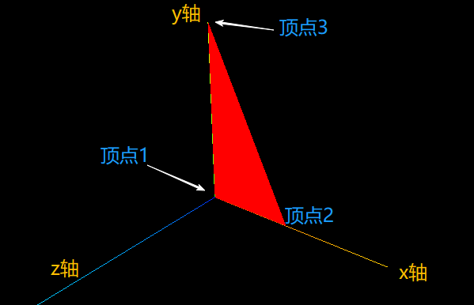

# 构造函数

## 概述

+ BufferGeometry()

  + 创建一个新的 BufferGeometry. 同时将预置属性设置为默认值

  ```js
  //创建一个空的几何体对象
  const geometry = new THREE.BufferGeometry();

  //类型化数组创建顶点数据
  const vertices = new Float32Array([
    0, 0, 0, //顶点1坐标
    50, 0, 0, //顶点2坐标
    0, 100, 0, //顶点3坐标
  ]);

  // 创建属性缓冲区对象
  //3个为一组，表示一个顶点的xyz坐标
  const attribue = new THREE.BufferAttribute(vertices, 3);

  // 设置几何体attributes属性的位置属性
  geometry.attributes.position = attribue;

  // 材质
  const metr = new THREE.MeshBasicMaterial({
    color: 0xff0000,
    side: THREE.DoubleSide, //两面可见
  })

  // 创建线模型对象
  const mesh = new THREE.Mesh(geometry, metr);

  // 将几何体添加到场景中
  scene.add( Model );
  ```

  
