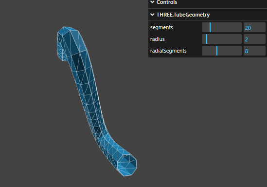

# 管道缓冲几何体 TubeGeometry

## 概述

+ 创建一个沿着三维曲线延伸的管道

  

## 构造器

+ TubeGeometry(path : Curve, tubularSegments : Integer, radius : Float, radialSegments : Integer, closed : Boolean)

+ 参数

  + path — Curve - 一个由基类Curve继承而来的3D路径。 默认是一条二次贝塞尔曲线
  + tubularSegments — Integer - 组成这一管道的分段数，默认值为64
  + radius — Float - 管道的半径，默认值为1
  + radialSegments — Integer - 管道横截面的分段数目，默认值为8
  + closed — Boolean 管道的两端是否闭合，默认值为false

  ```js
  import * as THREE from 'three';

  const p1 = new THREE.Vector3(-100, 0, 0);
  const p2 = new THREE.Vector3(50, 100, 0);
  const p3 = new THREE.Vector3(100, 0, 100);
  const p4 = new THREE.Vector3(100, 0, 0);

  const curve = new THREE.CubicBezierCurve3(p1, p2, p3, p4);

  const geometry = new THREE.TubeGeometry(curve, 50, 20, 20);

  const materail = new THREE.MeshLambertMaterial({
      color: new THREE.Color('orange'),
      side: THREE.DoubleSide,
      wireframe: true
  });

  const mesh = new THREE.Mesh(geometry, materail);

  const geometry2 = new THREE.BufferGeometry();
  geometry2.setFromPoints([p1,p2,p3,p4]);
  const material2 = new THREE.PointsMaterial({
      color: new THREE.Color('blue'),
      size: 10
  });
  const points2 = new THREE.Points(geometry2, material2);
  const line2 = new THREE.Line(geometry2, new THREE.LineBasicMaterial());
  mesh.add(points2, line2);

  export default mesh;
  ```
