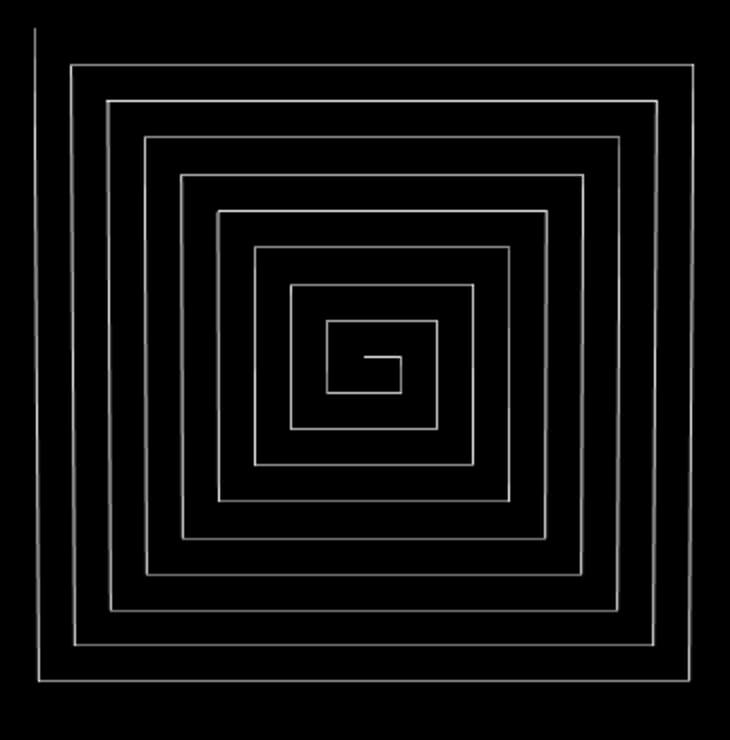

# 线段相关的材质

## 概述

+ THREE.LineBasicMaterial 是 Three.js 中用于渲染线条的一种材质类型。这种材质非常基础，它主要用来绘制简单的线段，支持基本的颜色设置和透明度调整
+ THREE.LineBasicMaterial 不支持光照模型，因此它不会根据光源的位置改变颜色或亮度

## LineBasicMaterial 示例

+ 示例1

  ```js
  // 创建几何体
  const points = [];
  points.push(new THREE.Vector3(-10, 0, 0));
  points.push(new THREE.Vector3(10, 0, 0));
  const geometry = new THREE.BufferGeometry().setFromPoints(points);

  // 创建 LineBasicMaterial
  const material = new THREE.LineBasicMaterial({
    color: 0xff0000, // 线条颜色
    linewidth: 2 // 线条宽度
  });

  // 创建线条
  const line = new THREE.Line(geometry, material);
  scene.add(line);
  ```

+ 示例2

  ```js
  var geometry = new THREE.Geometry();
  geometry.vertices.push(new THREE.Vector3(0, 0, 0));
  for (let i = 1; i < 10; i++) {
    geometry.vertices.push(new THREE.Vector3(i, i - 1, 0));
    geometry.vertices.push(new THREE.Vector3(i, -i , 0));
    geometry.vertices.push(new THREE.Vector3(-i, -i, 0));
    geometry.vertices.push(new THREE.Vector3(-i, i, 0));
  }
  var material = new THREE.LineBasicMaterial({
    color: '#ffffff',
  });
  var line = new THREE.Line(geometry, material);
  scene.add(line);
  ```

  

