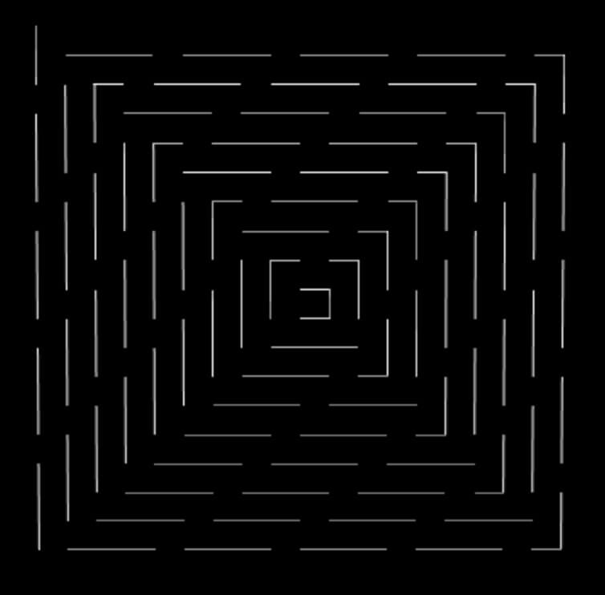

# LineDashedMaterial 虚线

## 概述

+ 用于创建虚线线条效果
+ `THREE.LineDashedMaterial` 是 Three.js 为了简化创建虚线线条而提供的一个方便的材质类型，它允许用户通过简单的属性配置来实现虚线效果，而不需要手动编写着色器

## 总结

+ THREE.LineDashedMaterial 是一种用于创建虚线线条的材质类型，适用于需要虚线效果的场景
+ 通过调整其属性，可以实现不同的视觉效果，如设置虚线段长度、间隙长度、线条宽度、颜色等
+ 这种材质非常适合用于绘制图表、路径、网格线等需要虚线效果的场景
+ 通过合理的配置，可以使得场景中的线条看起来更加符合设计需求

## LineDashedMaterial 虚线 示例

+ 示例1

  ```js
  var geometry = new THREE.Geometry();
  geometry.vertices.push(new THREE.Vector3(0, 0, 0));
  for (let i = 1; i < 10; i++) {
    geometry.vertices.push(new THREE.Vector3(i, i - 1, 0));
    geometry.vertices.push(new THREE.Vector3(i, -i , 0));
    geometry.vertices.push(new THREE.Vector3(-i, -i, 0));
    geometry.vertices.push(new THREE.Vector3(-i, i, 0));
  }
  var material = new THREE.LineDashedMaterial({
    color: '#ffffff',
    scale: 1,
    dashSize: 3,
    gapSize: 1,
  });
  var line = new THREE.Line(geometry, material);
  line.computeLineDistances();
  scene.add(line);
  ```

  

+ 示例2

  ```js
  // 创建几何体
  const points = [];
  points.push(new THREE.Vector3(-10, 0, 0));
  points.push(new THREE.Vector3(10, 0, 0));
  const geometry = new THREE.BufferGeometry().setFromPoints(points);

  // 创建 LineDashedMaterial
  const material = new THREE.LineDashedMaterial({
    color: 0xff0000, // 线条颜色
    linewidth: 2, // 线条宽度
    scale: 1, // 虚线比例
    dashSize: 3, // 虚线段长度
    gapSize: 1 // 虚线间隙长度
  });

  // 创建线条
  const line = new THREE.Line(geometry, material);
  scene.add(line);
  ```


