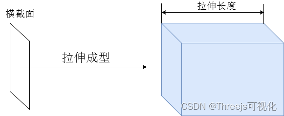
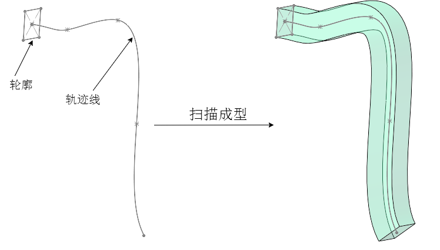

# 基础

## 拉伸几何体是什么

+ 从一个形状路径中，挤压出一个BufferGeometry

+ 拉伸是指我们有一个二维图形，通过针对这个二维图形进行z轴拉伸，将它转换成三维图形

  + 如果我们拉伸​ THREE.CircleGeometry ，就会得到一个类似圆柱体的图形
  + 如果我们拉伸​ THREE.PlaneGeometry ，就会得到一个立方体

  
  

## 构造函数

+ `new THREE.ExtrudeGeometry(shape, extrudeSettings)`

  + shape：一个 `THREE.Shape` 对象，定义了要挤出的二维轮廓

    + 传入 shape 或者 path 对象都行，因为 Shape 是 Path 的子类

      [alt text](images/shape与path.png)

  + extrudeSettings：一个包含挤出参数的对象，可选参数包括：

    + amount：挤出的距离，默认为 100
    + bevelEnabled：是否启用倒角，默认为 true
    + bevelThickness：倒角厚度，默认为 10
    + bevelSize：倒角大小，默认为 8
    + bevelSegments：倒角分割数量，默认为 1
    + steps：挤出路径分割的数量，默认为 1
    + curveSegments：曲线分割数量，默认为 12
    + uvGenerator：UV 坐标生成器，默认为 THREE.ExtrudeGeometryUVGenerator

  ```js
  // 创建一个矩形轮廓，并沿 Z 轴挤出 20 个单位的距离
  // 由于 bevelEnabled 设置为 false，所以没有倒角效果
  const shape = new THREE.Shape();
  shape.moveTo(10, 10);
  shape.lineTo(90, 10);
  shape.lineTo(90, 90);
  shape.lineTo(10, 90);
  shape.closePath();

  // 或者
  // Shape表示一个平面多边形轮廓
  const shape = new THREE.Shape([
    // 按照特定顺序，依次书写多边形顶点坐标
    new THREE.Vector2(-50, -50), //多边形起点
    new THREE.Vector2(-50, 50),
    new THREE.Vector2(50, 50),
    new THREE.Vector2(50, -50),
  ]);

  const geometry = new THREE.ExtrudeGeometry(shape, {
    amount: 20,
    bevelEnabled: false
  });

  // 设置材质
  const material = new THREE.MeshBasicMaterial({ color: 0xff0000 });
  const mesh = new THREE.Mesh(geometry, material);
  scene.add(mesh);
  ```

## 拉伸倒角

+ 倒圆角

  ```js
  const geometry = new THREE.ExtrudeGeometry(
    shape,{
      depth: 20,
      bevelThickness: 5, //倒角尺寸:拉伸方向
      bevelSize: 5, //倒角尺寸:垂直拉伸方向
      bevelSegments: 20, //倒圆角：倒角细分精度，默认3
    }
  );

  ```

+ 倒直角

  ```js
  const geometry = new THREE.ExtrudeGeometry(
    shape,{
      bevelThickness: 5, //倒角尺寸:拉伸方向
      bevelSize: 5, //倒角尺寸:垂直拉伸方向
      bevelSegments: 1, //倒直角
    }
  );
  ```

## 拉伸取消默认倒角

+ 拉伸造型

  ```js
  //拉伸造型
  const geometry = new THREE.ExtrudeGeometry(
    shape, //二维轮廓
    {
      depth: 20, //拉伸长度
      bevelEnabled: false, //禁止倒角,默认true
    }
  );
  ```

## 示例

+ 示例

  ```js
  import { Vector2,Shape,ExtrudeGeometry,MeshLambertMaterial,DoubleSide,Mesh,Group} from 'three';

  const arr = [
    new Vector2(-50, -50),
    new Vector2(-60, 0),
    new Vector2(0, 50),
    new Vector2(60, 0),
    new Vector2(50, -50),
  ]

  const shape = new Shape(arr);
  const geometry = new ExtrudeGeometry(shape, {
    depth: 20, //拉伸长度
  });

  const material = new MeshLambertMaterial({
    color: 0x00ffff,
    side:DoubleSide,//双面显示看到管道内壁
  })

  const mesh = new Mesh(geometry, material);

  const group = new Group;

  group.add(mesh)

  export default group;
  ```

