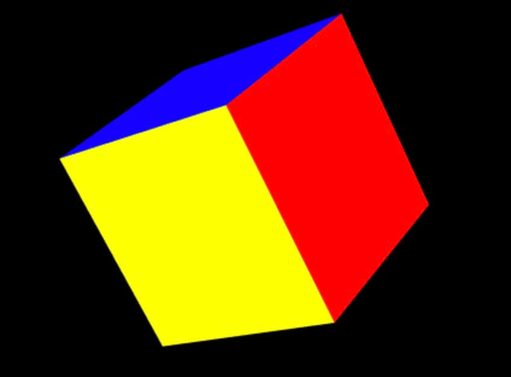

# 不同面使用不同的材质

## 概述

+ 不同面使用不同的材质很简单，只要把材质传一个数组就可以了，与联合材质不同的是，联合材质是多种材质混合使用，这里是每一个面用了一种材质

  ```js
  var geometry = new THREE.BoxGeometry(10, 10, 10, 3, 3, 3);
  var mats = [];
  mats.push(new THREE.MeshBasicMaterial({color: 0xff0000}));
  mats.push(new THREE.MeshBasicMaterial({color: 0x00ff00}));
  mats.push(new THREE.MeshBasicMaterial({color: 0x0000ff}));
  mats.push(new THREE.MeshBasicMaterial({color: 'orange'}));
  mats.push(new THREE.MeshBasicMaterial({color: 'yellow'}));
  mats.push(new THREE.MeshBasicMaterial({color: 'grey'}));

  mesh = new THREE.Mesh(geometry, mats);
  scene.add(mesh);
  ```

  
