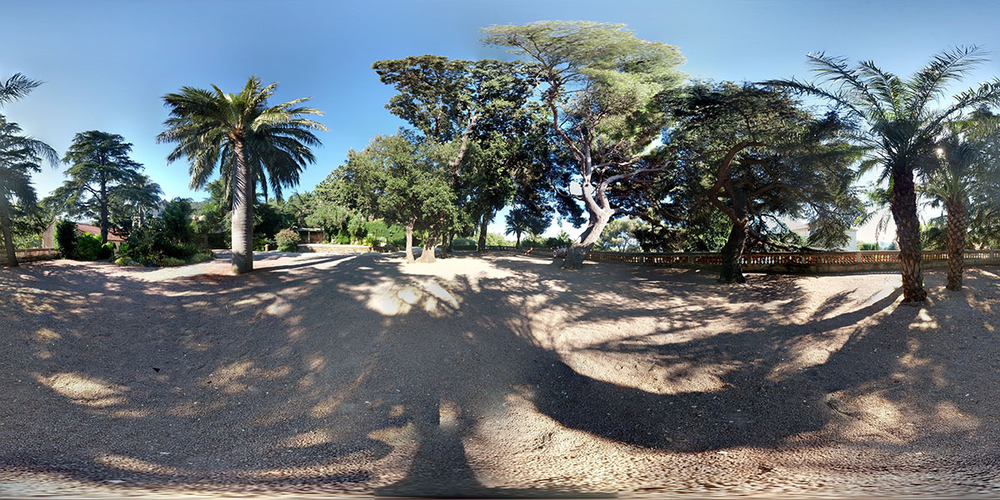
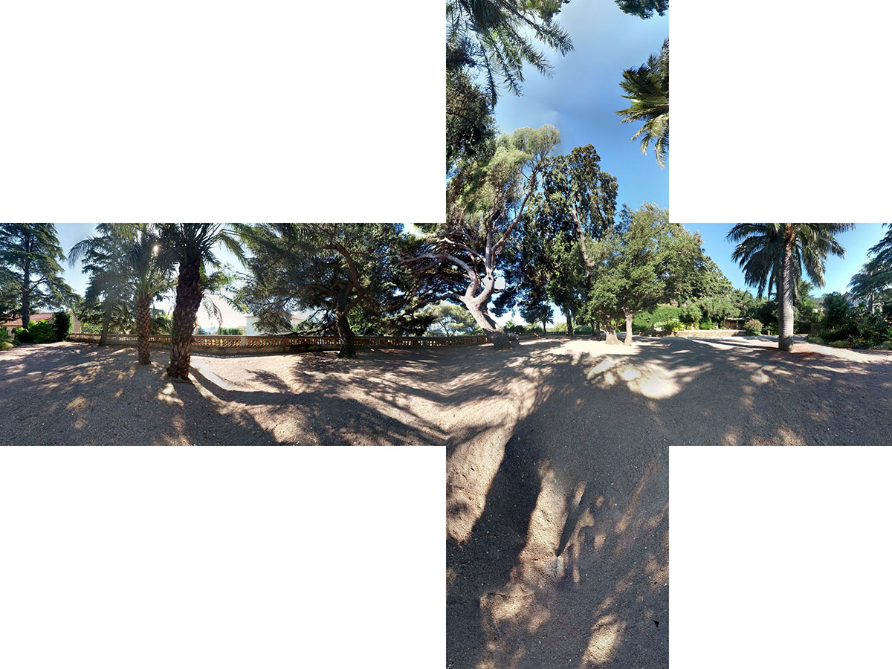

# 基础

## HDR

+ HDR全称High-Dynamic Range（高动态光照渲染），通过HDR，显示器或相机可以很好的表现超出其亮度范围的图像，也可以简单理解为HDR能大幅提高画面细节的明暗对比度
+ 直白点讲，HDR是指一个图像中最亮处和最暗处之间的比值，能够让图像明亮的地方更亮，而黑色的地方更黑暗深邃

+ 图像经HDR处理后的理想结果是亮处足够耀眼，暗处能够分辨物体的轮廓与深度，而非原图的一团漆黑

## HDR 组成

+ HDR由两部分组成，动态曝光控制和光晕效果

+ 动态曝光控制

  + 先说动态曝光控制，通常，显示器能够显示R、G、B分量在 `[0,255]` 之间的像素值。而256个不同的亮度级别显然不能表示自然界中光线的亮度情况
  + 举个例子，太阳的亮度是白炽灯亮度的几千倍或者被漫反射照亮的室内亮度的几万倍，这远远超出了显示器的亮度表示能力。HDR技术所要解决的问题就是在有限的亮度范围内表示出宽广的亮度范围
  + 原理类似于照相机的曝光功能，通过算法调整光线亮度，将光线从高动态范围映射到低动态范围，从而得到得到令人信服的光照效果

+ 光晕效果

  + 人从暗处走到光亮的地方，瞳孔由于来不及收缩，眼睛会自己眯起来，以保护视网膜上的感光细胞
  + HDR通过对原始图像进行调整，可以模拟这种人眼自动适应光线变化的生理反应，产生类似于光晕的效果

## 环境纹理 全景

+ 在Three中，环境纹理的实现一方面借助hdr材质的加载，另一方面借助于环境纹理实现的算法，其主要包括两种模式，

  + 一种是球面环境纹理

    + 球形全景是将球形的经度和纬度坐标，直接到水平和垂直坐标的一格，这个网格的高度大约宽的两倍
    + 因此从赤道到两极，横向拉伸不断加剧，南北两个极点被拉伸成了扁平的网格在整个上部和下部边缘
    + 球形全景可以现实整个水平和竖直的360全景

    

  + 一种是立方体环境纹理模式

    + 立方体全景是将全景图分成了前后左右上下六个面，浏览的时候将六个面结合成一个密闭空间来现实整个水平和竖直的360全景

    

+ 两种实现方式原理上与地图学中的投影相似

