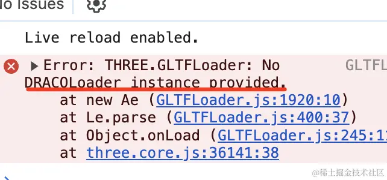

# DRACOLoader

## 概述

+ 一个用于加载经过Draco压缩的图形库

+ Draco是一个开源的库，主要用于压缩和解压缩三维模型及点云。 以客户端上解压缩为代价，显著减少压缩的图形

+ 独立的Draco文件后缀为.drc，其中包含顶点坐标，法线，颜色和其他的属性， Draco文件*不*包含材质，纹理，动画和节点结构-为了能使用这些特征，需要将Draco图形 嵌入到GLTF文件中

  + 使用glTF-Pipeline可以将一个普通的GLTF文件转化为经过Draco压缩的GLTF文件。 当使用Draco压缩的GLTF模型时，GLTFLoader内部会调用DRACOLoader

+ 推荐创建一个DRACOLoader实例并重用，可以有效避免重复创建加载多个解压器实例

  ```js
  const dracoLoader = new DRACOLoader();

  // 也可以创建之后关闭
  dracoLoader.dispose();
  ```

## 没有通过 DRACOLoader 解压会报错

+ 直接加载压缩过的模型会报错

  `No DRACOLoader instance provided`

  
