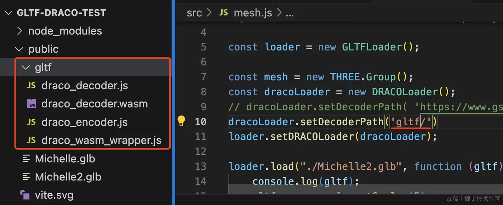

# DRACOLoader

## 概述

+ 通它是谷歌推出的，用于压缩和解压缩 3D 网格模型的一个库

## 没有通过 DRACOLoader 解压会报错

+ 直接加载压缩过的模型会报错

  `No DRACOLoader instance provided`

  

## 加载压缩的gltf文件 方式1

+ 文件 `node_modules`，找到目录`three\examples\jsm\libs\draco\gltf`，把里面文件复制到vue的public中，可以创建一个文件夹 `draco` ,复制到这个文件夹里面也行

  

  ```js
  给原来的gltf加载器设置解压功能
  import { DRACOLoader } from 'three/examples/jsm/loaders/DRACOLoader.js';
  const draco = new DRACOLoader();
  // DRACOLoader依赖examples\jsm\libs\draco\gltf里面多个解压文件
  draco.setDecoderPath('./draco/');//根据pubic里面解压文件结构设置
  ```

+ 给原来的gltf加载器设置解压功能

  ```js
  const loader = new THREE.GLTFLoader();
  loader.setDRACOLoader(draco);
  loader.load('./收费站.glb', function (gltf) {
    ...
  })
  ```

## 加载压缩的gltf文件 方式2

+ 从cdn中下载解码器

  ```js
  import {DRACOLoader} from 'three/examples/jsm/loaders/DRACOLoader.js'

  // 创建 DRACOLoader
  const dracoLoader = new DRACOLoader();

  // 指定 decoder 的路径，它会从这里下载解码器
  dracoLoader.setDecoderPath('https://www.gstatic.com/draco/versioned/decoders/1.5.6/');
  loader.setDRACOLoader(dracoLoader)
  ```
