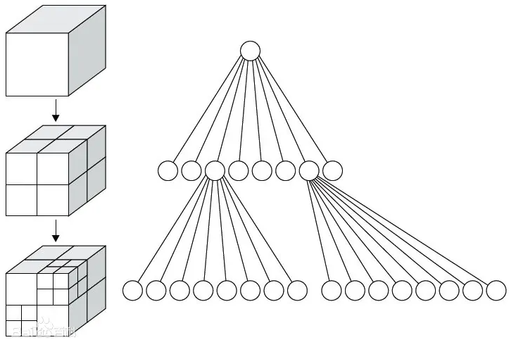

# 八叉树基本原理解释

## 使用

+ 使用

  ```js
  // 引入八叉树扩展库
  import { Octree } from 'three/examples/jsm/math/Octree.js';

  const worldOctree = new Octree();
  // 分割模型，生成八叉树节点
  worldOctree.fromGraphNode(模型对象);
  ```

+ 在.html文件中，你也可以配置为其它任意路径引入方式

  ```html
  <script type="importmap">
    {
    "imports": {
        "three": "../../../three.js/build/three.module.js",
        "three/addons/": "../../../three.js/examples/jsm/"
      }
  }
  </script>

  <script  type="module">
    import { Octree } from 'three/addons/math/Octree.js';
  </script>
  ```

## 1. 项目引入Octree.js

+ Three.js在目录/examples/jsm/math/下提供了一个八叉树相关的扩展库Octree.js。
+ npm安装threejs情况下，Octree.js扩展库引入路径

  ```js
  // 引入/examples/jsm/math/目录下八叉树扩展库

  import { Octree } from 'three/examples/jsm/math/Octree.js';
  ```

## 2. 生成八叉树.fromGraphNode()

+ 实例化一个八叉树对象

  ```js
  const worldOctree = new Octree();
  ```

+ `.fromGraphNode()` 的参数是模型对象，比如一个mesh，或者多个mesh构成的层级模型

  ```js
  const gltf = await loader.loadAsync("../地形.glb");
  worldOctree.fromGraphNode(gltf.scene);
  ```

+ 执行 `.fromGraphNode()` 会对模型进行分割，分割为一个一个的小的长方体空间，构成一个八叉树

  

+ 执行 `.fromGraphNode()` 会把一个3D模型，分割为8个子空间，每个子空间都包含对应的三角形或者说顶点数据，每个子空间还可以继续分割

## 浏览器控制台打印八叉树

+ 浏览器控制台打印八叉树，查看分割的结果

  ```js
  console.log('查看八叉树结构', worldOctree);
  ```

  + `.box` 属性是包围盒Box3，描述当前分割的子空间位置和尺寸
  + `.subTrees` 属性表示八叉树的子节点，类似threejs层级模型的 `children` 属性
  + 查看叶子结点(最后一层没有子对象的节点) `.triangles` 属性,可以看到包含的三角形数据
