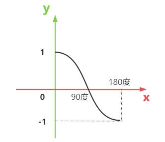

# 0~180度三角函数余弦值规律

## 概述

+ 0~90度，余弦值大于0
+ 90~180度，余弦值小于0

  
  

## 总结

+ 向量a和b夹角，在0~180度的范围内的前提下：

  + 当a和b点乘 `a.dot(b)` 大于0,意味着cos(θ)大于0，cos(θ)大于0意味着夹角θ是0~90度，θ是0~90度说明物体在人的前方

  + a和b点乘 `a.dot(b)` 小于0,意味着cos(θ)小于0，0~180度的范围内，cos(θ)小于0，意味着夹角θ是90~180度，θ是90~180度说明物体在人的后方

  ```js
  const dot = a.dot(b);//向量a和b点乘

  if (dot > 0) {
    console.log('物体在人前面');
  } else if (dot < 0) {
    console.log('物体在人后面');
  }
  ```

  
