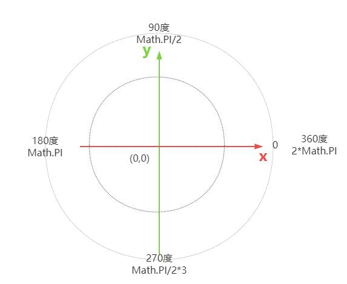

# 弧度

## 概述

+ 角度是将圆的一周视之为360°

+ 弧度是将圆的一周视之为归一化的圆的周长，即2πr，归一化的半径r 是1，因此弧度中圆的一周就是2π。

+ 角度与弧度的互转- 角度转弧度：

  + 1度 = 2π/360 = π/180 弧度
  + 1 弧度 = 360/2π = 180/π 度

  ```js
  const angle = Math.PI/6; // 30度
  const angle = Math.PI/2; // 90度
  const angle = Math.PI; // 180度
  ```

  
