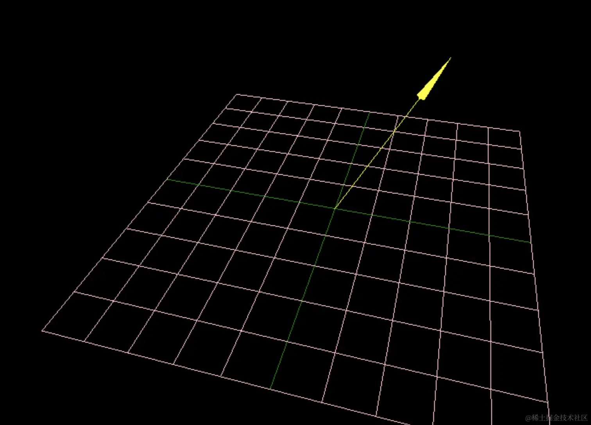

# 射线Ray

## 概述

+ 写 2D 网页的时候，我们经常 click click 点点点，到了 3D 不能点击的话，还有点不习惯。

+ 这节我们就来实现点击选中 3D 场景中的物体的功能。

+ 3D 场景中点击的实现是基于射线 Ray

  + 它就是一条射线，也就是确定起点 origin 和方向 direction 就可以形成一条射线

  + 那这条射线穿过了网格模型的某个三角形，就是射中了这个 Mesh

  

+ 射线 `Ray` 和三维向量 `Vector3` 一样属于数学几何计算相关的API,可以进行射线交叉计算


## 在 Three.js 中应用

+ 碰撞检测：可以用来检测射线是否与几何体相交

  ```js
  // 有一条射线和一个球体，想要检测射线是否与球体相交
  const ray = new THREE.Ray(new THREE.Vector3(0, 0, 0), new THREE.Vector3(0, 0, 1));
  const sphere = new THREE.Sphere(new THREE.Vector3(0, 0, 5), 2);

  if (ray.intersectsSphere(sphere)) {
    console.log('Ray intersects the sphere.');
  }
  ```

+ 光线追踪：在光线追踪算法中，可以用来计算光线与几何体的交点
+ 拾取：在用户交互中，可以用来检测用户点击的物体
