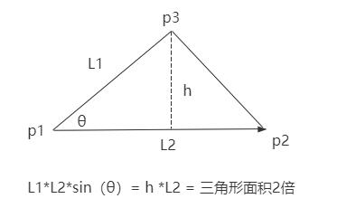

# 计算物体的表面积

## 知识点回顾：三角形面积

+ 叉乘 `.cross()` 和 `.length()` 计算三角形面积公式

  

  ```js
  const a = p2.clone().sub(p1);
  const b = p3.clone().sub(p1);
  const c = a.clone().cross(b);
  const S = 0.5*c.length();// 三角形面积
  ```

## 知识点回顾：网格模型的三角形

+ 网格模型Mesh其实就一个一个三角形拼接构成
+ 这意味着，我们可以通过计算Mesh所有三角形面积，然后累加，就可以获取模型的表面积

  

+ 几何体结构分为两种情况，一种有顶点索引index数据，一种没有，整体思路相同，只是注意获取顶点位置数据的语法细节不同

## 方式1：Geometry有顶点索引数据

+ 步骤1：三角形面积计算

  ```js
  //三角形面积计算

  function AreaOfTriangle(p1, p2, p3) {
    // 三角形两条边构建两个向量
    const a = p2.clone().sub(p1);
    const b = p3.clone().sub(p1);
    // 两个向量叉乘结果c的几何含义：a.length()*b.length()*sin(θ)
    const c = a.clone().cross(b);
    // 三角形面积计算
    const S = 0.5 * c.length();
    return S
  }
  ```

+ 步骤2：获取模型对象所有的三角形，分别计算某个三角形对应的面积，然后所有三角形面积累加，就可以获取模型的表面积

  ```js
  const pos = geometry.attributes.position;
  const index = geometry.index;
  console.log('geometry',geometry);

  let S = 0;//表示物体表面积
  for (var i = 0; i < index.count; i += 3) {
    // 获取当前三角形对应三个顶点的索引
    const i1 = index.getX(i);
    const i2 = index.getX(i + 1);
    const i3 = index.getX(i + 2);

    //获取三个顶点的坐标
    const p1 = new THREE.Vector3(pos.getX(i1), pos.getY(i1), pos.getZ(i1));
    const p2 = new THREE.Vector3(pos.getX(i2), pos.getY(i2), pos.getZ(i2));
    const p3 = new THREE.Vector3(pos.getX(i3), pos.getY(i3), pos.getZ(i3));
    S += AreaOfTriangle(p1, p2, p3);
  }
  console.log('S',S);

  //三角形面积计算
  function AreaOfTriangle(p1, p2, p3) {
    // 三角形两条边构建两个向量
    const a = p2.clone().sub(p1);
    const b = p3.clone().sub(p1);
    // 两个向量叉乘结果c的几何含义：a.length()*b.length()*sin(θ)
    const c = a.clone().cross(b);
    // 三角形面积计算
    const S = 0.5 * c.length();
    return S
  }
  ```

## 方式2：Geometry没有顶点索引数据

+ Geometry没有顶点索引数据,直接从顶点位置属性获取每间隔三个点作为一个三角形数据

  ```js
  const pos = geometry.attributes.position;

  let S = 0;//表示物体表面积
  for (let i = 0; i < pos.count; i += 3) {
    const p1 = new THREE.Vector3(pos.getX(i), pos.getY(i), pos.getZ(i));
    const p2 = new THREE.Vector3(pos.getX(i + 1), pos.getY(i + 1), pos.getZ(i + 1));
    const p3 = new THREE.Vector3(pos.getX(i + 2), pos.getY(i + 2), pos.getZ(i + 2));
    S += AreaOfTriangle(p1, p2, p3);//所有三角形面积累加
  }
  console.log('S', S);

  //三角形面积计算
  function AreaOfTriangle(p1, p2, p3) {
    // 三角形两条边构建两个向量
    const a = p2.clone().sub(p1);
    const b = p3.clone().sub(p1);
    // 两个向量叉乘结果c的几何含义：a.length()*b.length()*sin(θ)
    const c = a.clone().cross(b);
    // 三角形面积计算
    const S = 0.5 * c.length();
    return S;
  }
  ```
