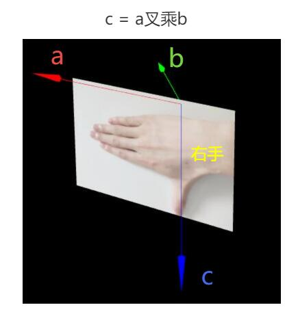

# 向量叉乘cross

## 概述

+ threejs三维向量 `Vector3` 提供了叉乘的两个相关方法 `.crossVectors()` 和 `.cross()`

+ 叉乘也有其它称呼，比如向量积、外积、叉积、矢积

## 叉乘结果向量c几何含义

+ 一方面是向量方向，刚刚通过可视化箭头给大家总结过，向量a叉乘向量b，得到一个新的向量c，向量c垂直于向量a和b构成的平面，或者说向量c同时垂直于向量a、向量b。

+ 另一方面是向量长度，假设向量a和b的夹角是θ，a和b叉乘结果是c，c的长度 `c.length()` 是a长度 `a.length()` 乘b长度 `b.length()` 乘夹角θ的正弦值 `sin(θ)`

  ```js
  c.crossVectors(a,b);

  c.length() = a.length()*b.length()*sin(θ)
  ```

  

## 可视化叉乘结果c

+ 向量c垂直于向量a、b构成的平面，或者说向量c同时垂直于向量a、向量b

  ```js
  const a = new THREE.Vector3(50,0,0);
  const b = new THREE.Vector3(30,0,30);

  // 设置一个起点
  const o = new THREE.Vector3(0,0,0);

  // 红色的箭头表示向量a
  const arrowA = new THREE.ArrowHelper( a.clone().normalize(), o, a.length(), 0xff0000 );

  // 绿色的箭头表示向量a
  const arrowB = new THREE.ArrowHelper( b.clone().normalize(), o, b.length(), 0x00ff00 );

  const c = new THREE.Vector3();

  //向量a叉乘b，结果保存在向量c
  c.crossVectors(a,b);
  console.log('叉乘结果',c);//叉乘结果是一个向量对象Vector3

  // 可视化向量a和b叉乘结果：向量c
  const arrowC = new THREE.ArrowHelper(c.clone().normalize(), o, c.length()/30,0x0000ff);
  ```

  

## 向量b叉乘向量a.crossVectors(b,a)

+ 向量b叉乘向量 `a.crossVectors(b,a)`

  ```js
  c.crossVectors(a,b); // a叉乘b

  c.crossVectors(b,a); // b叉乘a
  ```

+ 箭头可视化向量b叉乘a `c.crossVectors(b,a)` 的结果，你会发现向量c与原来向量a叉乘b `c.crossVectors(a,b)` 的方向反过来

  ```js
  // 可视化向量b和a叉乘结果：向量c
  new THREE.ArrowHelper(c.clone().normalize(), O, c.length()/30,0x0000ff);
  ```

  

## 总结：叉乘不满足交换律

+ 通过比较向量a叉乘b与向量b叉乘a区别，顺序不同结果不同，也就是说叉乘不满足交换律

  ```js
  // a叉乘b
  c.crossVectors(a,b);

  // b叉乘a
  c.crossVectors(b,a);
  ```

  

## 叉乘方向(右手螺旋定则判断)

+ 首先明确一定，向量a、b叉乘，得到一个向量c，向量c垂直于向量a、b。

+ 假设向量a和向量b在水平地上，那么向量c，要么竖直向上，要么竖直向下。如果想具体判定向量c的朝向，最简单的方式，就是用箭头 `ArrowHelper` 可视化c，一看便知

+ 偏理论的方式就是通过右手螺旋定则，判断叉乘结果c的方向，没有threejs箭头简单直观，如果你不想掌握，也没关系，写代码时候，用ArrowHelper类辅助判断

  

+ 你先把向量c想象成一根筷子，尝试用手去握住它。具体过程就是，把右手手掌展平，四指并拢，大拇指与四指垂直，假设向量a和b处于水平平面上，向量c就是竖直方向，让大拇指沿着c，大拇指朝上还是朝下，随便先选个方向，让四指沿着向量a的方向，去开始握住向量c，这时候如果四指旋转的方向靠近向量b，那么说明大拇指的指向方向是向量c的方向，否则反之
