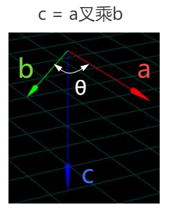
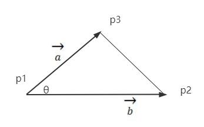

# 计算三角形面积

## 向量叉乘几何意义

+ 假设向量a和b的夹角是θ，a和b叉乘结果是c，c的长度 `c.length()` 是a长度 `a.length()` 乘b长度 `b.length()` 乘夹角θ的正弦值 `sin(θ)`

  ```js
  c.crossVectors(a,b);
  c.length() = a.length()*b.length()*sin(θ)
  ```

  
  

## 三角形两条边与夹角正弦值相乘的几何含义

+ `L1 x L2 x sin(θ)`= `h x L2` = 三角形面积2倍

  

+ 可以用三角形的两条边构建两个向量进行叉乘，叉乘的结果c的长度就表示三角形面积的2倍

## 叉乘.cross()和.length()计算三角形面积公式

+ 叉乘.cross()和.length()计算三角形面积公式

  

  ```js
  // 三角形两条边构建两个向量
  const a = p2.clone().sub(p1);
  const b = p3.clone().sub(p1);

  // 两个向量叉乘结果c的几何含义：a.length()*b.length()*sin(θ)
  const c = a.clone().cross(b);

  // 三角形面积计算
  const S = 0.5*c.length();

  console.log('S',S);
  ```
