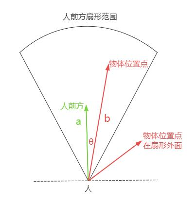

# 点乘判断是否在扇形内

## 概述

+ 通过three.js向量 `Vector3` 点乘方法 `.dot()` 判断一个点(物体)是否在人前方的扇形范围内

  

## 已知条件

+ 判断一个点(物体)是否在人前方扇形范围内(半径 `R`、扇形角度 `angle`)

  ```js
  // 已知数据
  person.position.set(0, 0, 2);//人位置
  mesh.position.set(2, 0, -3);//物体位置

  // a向量：人的正前方沿着z轴负半轴
  const a = new THREE.Vector3(0, 0, -1);

  // 扇形范围
  const R = 20;//人前方扇形半径
  const angle = 60; // 人前方扇形角度
  ```

## 先通过人与物体距离排除，物体不在扇形范围内情况

+ 计算物体与人的距离

  ```js
  // 物体坐标减去人坐标，创建一个人指向物体的向量
  const b = mesh.position.clone().sub(person.position);
  const L = b.length();//物体与人的距离
  ```

+ 比较距离L与扇形半径的关系，排除物体不在扇形范围内的情况

  ```js
  if (L < R) {//物体与人的距离在半径R以内
    console.log('物体与人距离小于扇形半径');
  }else{
    console.log('不在扇形区域内');
  }
  ```

## 比较夹角余弦值大小判断物体是否在扇形内

+ 向量点乘 `a.dot(b)` 点乘计算向量a和b的夹角余弦值cos

  ```js
  b.normalize();//归一化

  const cos = a.dot(b);//向量a和b夹角余弦值
  ```

+ 在扇形范围内，从人所在位置，向外沿着扇形半径方向绘制向量c，你会发现向量c与向量a最大夹角就是扇形角度一半

  ```js
  // 角度转弧度
  const rad = THREE.MathUtils.degToRad(angle);

  // 扇形角度一半的余弦值
  const rangeCos = Math.cos(rad / 2)
  ```

+ 比较向量a、b夹角余弦值cos和扇形角度一半的余弦值rangeCos大小，判断物体是否在扇形内

  ```js
  if (L < R) {
    if (cos > rangeCos) { //物体在人前方扇形里面
      console.log('cos',cos);
      console.log('人在半径为R，角度为angle的扇形区域内');
    }else{
      console.log('不在扇形区域内');
    }
  }else{
    console.log('不在扇形区域内');
  }
  ```
