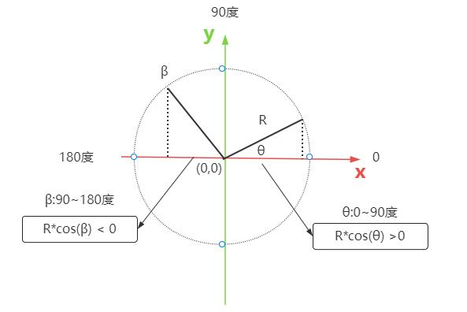
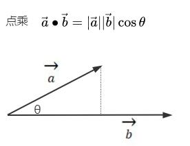

# 点乘判断平行向量方向异同

## 概述

+ 通过three.js点乘方法 `.dot()` 判断两个平行的向量，方向是相同还是不同的

## 已知条件

+ 已知条件

  ```js
  // 已知条件：判断两个平行的向量方向是否相同
  const a = new THREE.Vector3(10, 0, 0);
  const b = new THREE.Vector3(200, 0, 0);//与a平行且方向相同
  const b = new THREE.Vector3(-50, 0, 0);//与a平行且方向相反
  ```

## 夹角余弦值与向量

+ 两个平行向量方向相同，意味着夹角0度，夹角余弦值cosθ等于1

+ 两个平行向量方向相反，意味着夹角180度，夹角余弦值cosθ等于-1

  

## 通过点乘判断平行向量方向异同

+ 假设两个向量的夹角是θ，两个向量的单位向量进行点乘 `.dot()`，返回的结果就是夹角θ的余弦值 `cos(θ)`

  


  ```js
  const a = new THREE.Vector3(10, 10, 0);
  const b = new THREE.Vector3(20, 0, 0);

  // a、b向量归一化后点乘
  const cos =  a.normalize().dot(b.normalize());
  console.log('向量夹角余弦值',cos);
  ```

  ```js
  // a、b向量归一化后点乘
  const cos =  a.normalize().dot(b.normalize());

  //注意判断的前提是，两个向量是平行的，余弦值要么1，要么-1
  if(cos > 0.5){
    console.log('方向相同');
  }else{
    console.log('方向相反');
  }
  ```
