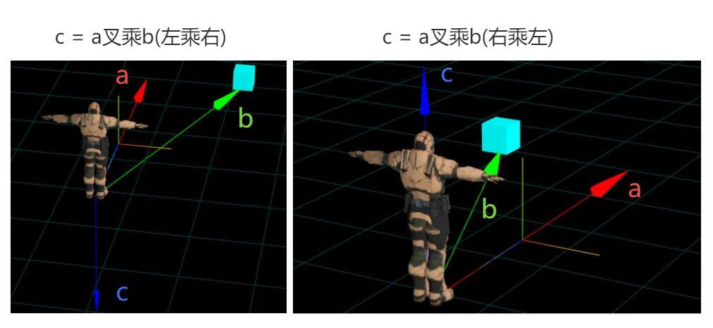

# 叉乘判断人左右

## 已知条件

+ 假设人和物体在XOZ水平面上，下面在XOZ平面上，随机选择了两个坐标，作为人和物体的位置，选择一个方向作为人的正前方

  ```js
  person.position.set(0, 0, 2); // 人位置

  // a向量：假设人的正前方沿着z轴负半轴
  const a = new THREE.Vector3(0, 0, -5);
  ```

  ```js
  // 箭头可视化向量a
  const arrowA = new THREE.ArrowHelper(a.clone().normalize(), person.position, a.length(),0xff0000);

  model.add(arrowA);
  ```

+ 物体位置选择了两种情况，一个在人的左侧(左前方)，一个在人的右侧(右前方)

  ```js
  mesh.position.set(2, 0, -3);//物体位置在人右边

  mesh.position.set(-2, 0, -3);//物体位置在人左边
  ```

## 创建人指向物体的向量b

+ 物体两个位置对应的两个向量b，分别位于向量a左右两侧

  ```js
  const b = mesh.position.clone().sub(person.position);

  const arrowB = new THREE.ArrowHelper(b.clone().normalize(), person.position, b.length(),0x00ff00);

  model.add(arrowB);
  ```

## a叉乘b

+ a叉乘b

  ```js
  const c = a.clone().cross(b);

  c.normalize()
  ```

  ```js
  // 可视化向量c方向
  const arrowC = new THREE.ArrowHelper(c, person.position, 2.5 ,0x0000ff);
  ```

## 叉乘方向总结

+ 假设向量a和b在水平面上，向量a叉乘b得到结果向量c

+ 对比物体两种位置情况，你会发现当向量b在向量a右侧(物体在人右侧)时，向量c竖直向下，当向量b在向量a左侧(物体在人左侧)时，向量c竖直向上

  

+ 向量旋转不超过180度情况下，向量b在向量a右侧，说明向量a顺时针旋转与b重合，向量c竖直向下，当向量b在向量a左侧时，说明向量a逆时针旋转与b重合，向量c竖直向上

  

+ 你只需要记住，一个向量a与其他向量相乘，如果其他向量，位于向量a同一侧，叉乘方向相同，如果不同一侧，方向不同
+ 如果具体判断方向，可以通过右手螺旋定则

## 根据向量c方向判断物体在人左侧还是右侧

+ 根据向量c方向判断物体在人左侧还是右侧

  ```js
  // 根据向量c方向，判断物体在人的左侧还是右侧
  if(c.y < 0){
    console.log('物体在人右侧');
  }else if(c.y > 0){
    console.log('物体在人左侧');
  }
  ```
