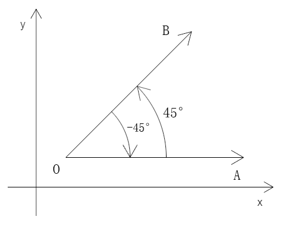
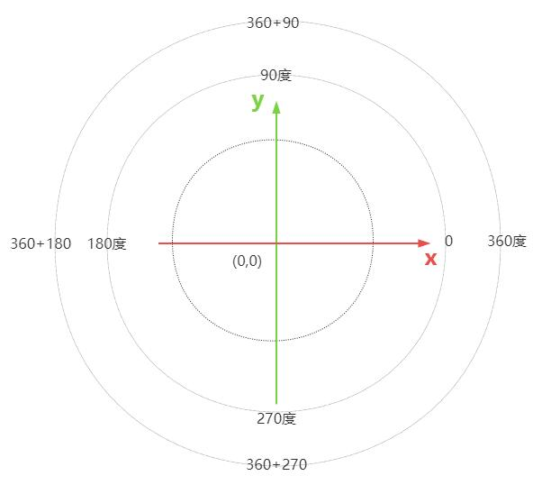

# 角

## 概念

+ 角：具有公共端点的两条射线组成的图形，如上图∠AOB
+ 角的顶点：组成角的两条射线的公共端点，如上图点O
+ 角的边：组成角的两条射线，如上图射线OA、射线OB

  

## 在二维平面中理解角

+ 角可以理解为一条射线围绕角的端点，从当前位置，旋转到另一个位置后形成的图形

+ 如∠AOB 可视之为射线OA 围绕其始点O旋转45°后，形成的现在的射线和过去的射线的夹角

+ 射线旋转经过的平面部分为角的内部

+ 不考虑旋转的方向，无论从OA 旋转到OB，还是OB 旋转到OA，它们旋转的绝对量都是一样的，且在0°-360° 之间

+ 零角：x 轴正方向的角

+ 角的方向：从x 轴的正方向开始，向y 轴的正方向旋转（旋转的绝对量为90°），此角为正角；反之为负角

  

## 注意

+ 注：在canvas 2d 的坐标系中，y 轴朝下，顺时针旋转的方向为正角；在webgl 的坐标系中，y 轴朝上，逆时针旋转的方向为正角
