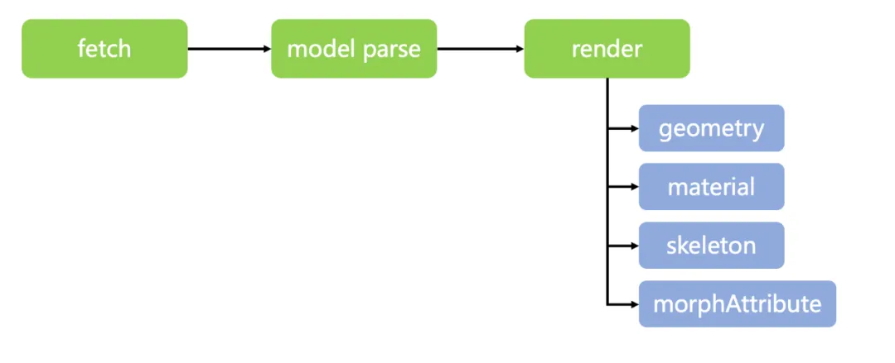
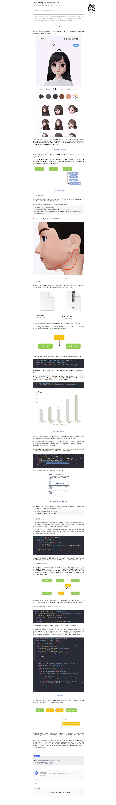

# 模型加载优化

## 模型加载的优化思路

+ 在Three.js中，模型从加载到渲染需要经过模型下载、序列化模型、网格解析、写入缓存和渲染模型几个步骤
+ 经过分析发现主要的瓶颈在*网络请求*和*网格解析*两个部分，所以整体的优化思路就是减少网络请求资源的体积和提升网格的解析速度

  

## 参考

+ [text](https://mp.weixin.qq.com/s/6EeonnvxzeQjDouSMHEHRQ)

  
