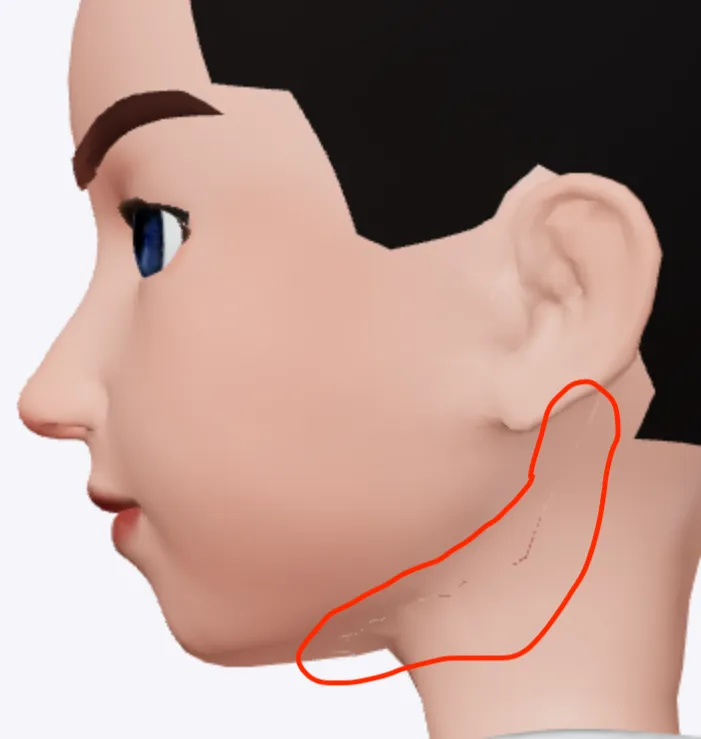
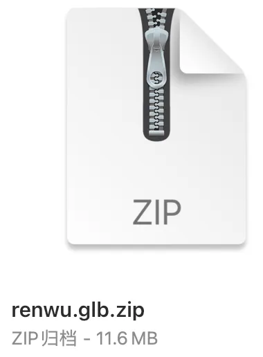
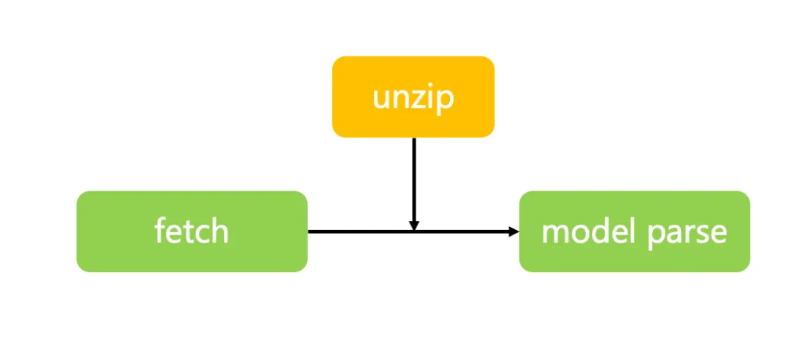

# 缩小模型的体积

## 缩小模型的体积-方案1

+ 目前主流的压缩方案是使用google的draco库对模型进行压缩。draco的原理类似降低图片的分辨率，通过减少模型的顶点数起到压缩体积的效果

+ 也就是说draco是一种有损的压缩方式，这样就会带来诸多的问题

  + 可能在网格连接处存在画面模型撕裂
  + 仅仅压缩顶点只能将50.7mb的人物模型压缩到49.5，压缩效果有限
  + draco前台decoder在h5中的解算效率不理想，可能节省下来的网络请求时间还没有增加的数据解算的时间长

  

## 缩小模型的体积-方案2

+ 将glb模型直接打成zip包可以明显的提升模型的压缩效率。50.7mb的人物模型可以压缩到11.6mb

  

+ 但是Three.js提供的gltfloader是不能直接加载zip文件的，于是我们需要对其进行功能扩展
+ Three.js加载gltf模型是首先通过fetch请求获取到模型的arraybuffer，再对arraybuffer进行格式化。所以我们只需要在模型格式化之前拦截zip文件进行解压缩即可

  

+ 使用 jszip ，资源加载完成后判断资源的后缀，如果是zip文件就使用jszip进行解压缩

  ```js
  if (url.substr(-4).toLowerCase() === '.zip') {
    const file = await ZIP.loadAsync(data);
    data = await file.files['model.glb'].async('arraybuffer')
  }
  ```
