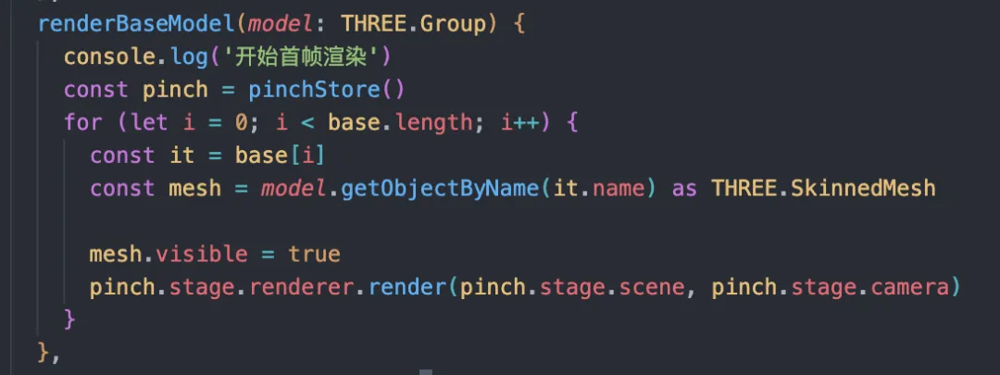

# 优化首帧的渲染体验

## 概述

+ 优化完模型的加载，继续来优化模型的渲染，在加载一个体积比较大的模型的时候经常会有页面的卡死的情况出现，需要从两方面治标也治本的进行优化

  1. 通过减少页面的卡停来优化用户的感官体验
  2. 通过缩短首屏渲染的时长来解决根本问题

## 减少页面的卡停

+ 在模型加载的时候通常会设置一个loading页面来展示当前的加载进度，同时loading页也可以播放一些动效或者互动来让用户等待的过程中不那么无聊。但是由于js单线程的特性，在进行首帧渲染的时候任何事件都不无法响应，会让用户误以为页面卡死，造成流失

+ 为了解决这个问题我们可以使用分步加载的方案，在模型加载的时候先遍历第一层网格，将所有的网格隐藏起来，然后循环这些网格，每展示一个就执行一次render方法，这样就可以把一个大的卡顿分散成多个小的，不至于影响前台的体验

  

  + 但是这样的方法只能让用户感受起来没那么卡顿，该等的时间一点没少，过长的等待时间还是会让用户等的不耐烦，有没有其他解决卡顿的方式呢？这就要从Three.js的渲染逻辑来进行分析了

## 缩短首帧渲染的时间

