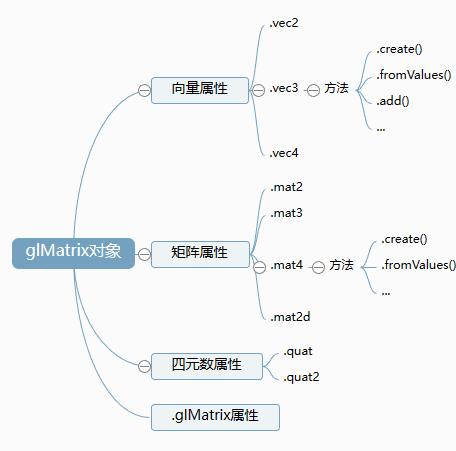

# 基础

## 概述

+ `gl-matrix` 提供了矩阵、向量、四元数等等与图形学相关的数学计算函数，直接调用即可

  

## 引用

+ gl-matrix github地址：`https://github.com/toji/gl-matrix`

+ gl-matrix官网：`http://glmatrix.net`

+ gl-matrix官网文档：`http://glmatrix.net/docs`

  ```js
  npm install gl-matrix -S

  import * as glMatix from 'gl-matrix'
  ```

+ 浏览器中 es6语法import方式引入

  ```html
  <script type="module">
    import * as glMatrix from './gl-matrix-master/dist/esm/index.js'
    console.log('glMatrix.mat4', glMatrix.mat4);

  </script>
  ```

+ 只引入mat4矩阵API

  ```html
  <script type="module">
    import { mat4 } from './gl-matrix-master/dist/esm/index.js'
    console.log('mat4', mat4);

  </script>
  ```
