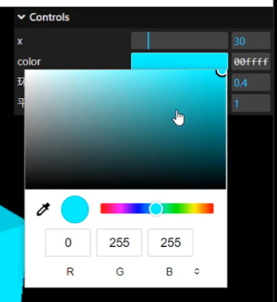

# 颜色面板

## API

+ `addColor( object, property, rgbScale=1 )` 生成颜色值改变的交互界面

  + object：目标对象
  + property：目标对象中作为颜色的属性名称
  + rgbScale：颜色通道的最大值，默认为1

  

## 颜色类型

+ 颜色类型

  ```js
  obj = {
    color1: '#AA00FF',
    color2: '#a0f',
    color3: 'rgb(170, 0, 255)',
    color4: 0xaa00ff
  }

  gui.addColor( obj, 'color1' );
  gui.addColor( obj, 'color2' );
  gui.addColor( obj, 'color3' );
  gui.addColor( obj, 'color4' );
  ```

# 数据类型

+ 颜色通道假定介于 0 和 1 之间，但您也可以将 自己的范围。颜色对象和数组永远不会被替换，只会修改它们的组件

  ```js
  obj = {
    colorObject: { r: 0.667, g: 0, b: 1 }, // 对象
    colorArray: [ 0.667, 0, 1 ] // 数组
  }

  gui.addColor( obj, 'colorObject' );
  gui.addColor( obj, 'colorArray' );
  ```

  

## RGB 通道范围

+ RGB 对象和数组的通道范围可以通过传递第三个控制器来覆盖每个控制器 参数设置为 .如果您的颜色太亮，您可能需要将其设置为 255

  ```js
  obj = {
    colorObject: { r: 170, g: 0, b: 255 },
    colorArray: [ 170, 0, 255 ]
  }

  gui.addColor( obj, 'colorObject', 255 );
  gui.addColor( obj, 'colorArray', 255 );
  ```

  
