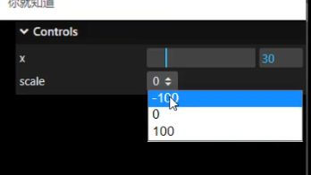

# 交互类别

## 颜色面板

+ `.addColor()` 生成颜色值改变的交互界面

  

  ```js
  const obj = {
    color:0x00ffff,
  };

  // .addColor()生成颜色值改变的交互界面
  gui.addColor(obj, 'color').onChange(function(value){
    mesh.material.color.set(value);
  });
  ```

## 设置范围，滑动控制

+ `类别变量名.add(参数名, ‘变量显示名’,最小值, 最大值, 精度).onChange( 函数名 );`

  ```js
  foldergeometry.add(control,'rotateY',-200,200).onChange(e => {
    //mesh.rotateX(e);
    mesh.rotateY(e);
  })
  ```

## 下拉菜单之 数组

+ `.add()` 方法参数3数据类型：*数组*

  

+ 参数3是一个数组，生成交互界面是下拉菜单

  ```js
  const obj = {
    scale: 0,
  };

  // 参数3数据类型：数组(下拉菜单)
  gui.add(obj, 'scale', [-100, 0, 100]).name('y坐标').onChange(function (value) {
      mesh.position.y = value;
  })
  ```

## 单选框

+ `类别变量名.add(参数名, ‘变量显示名’).onChange( 函数名 );`
+ 数据类型 **布尔值**

  

  ```js
  const obj = {
    bool: false,
  };

  // 改变的obj属性数据类型是布尔值，交互界面是单选框
  gui.add(obj, 'bool').name('是否旋转');
  ```

  ```js
  gui.add(obj, 'bool').onChange(function (value) {
    // 点击单选框，控制台打印obj.bool变化
    console.log('obj.bool',value);
  });
  ```

## 下拉菜单之 对象

+ `.add()` 方法参数3数据类型：*对象*
+ 参数3是一个对象，生成交互界面是下拉菜单

  ```js
  const obj = {
    scale: 0,
  };

  // 参数3数据类型：对象(下拉菜单)
  gui.add(obj, 'scale', {
    left: -100,
    center: 0,
    right: 100
    // 左: -100,//可以用中文
    // 中: 0,
    // 右: 100
  }).name('位置选择').onChange(function (value) {
    mesh.position.x = value;
  });
  ```

