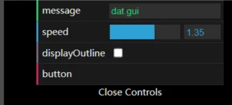

# 交互样式

## 拖动条

+ `.add()` 方法参数3和4数据类型：*数字*
+ `add(控制对象，对象具体属性，其他参数)`

  + 其他参数，可以一个或多个，数据类型也可以不同，gui会自动根据参数形式，自动生成对应的交互界面

  + 参数3和参数4，分别是一个数字，交互界面是一个鼠标可以拖动的拖动条，可以在一个区间改变属性的值

  ```js
  // 参数3、参数4数据类型：数字(拖动条)
  gui.add(obj, 'x', 0, 180).onChange(function (value) {
    mesh.position.x = value;
  });
  ```

## 下拉菜单1


## 下拉菜单2


## 单选框

+ `.add()` 方法对应属性的数据类型：*布尔值*


+ `.add()` 改变属性的对应的数据类型如果是布尔值，那么交互界面就是一个单选框

  ```js
  const obj = {
    bool: false,
  };

  // 改变的obj属性数据类型是布尔值，交互界面是单选框
  gui.add(obj, 'bool').name('是否旋转');
  ```

  ```js
  gui.add(obj, 'bool').onChange(function (value) {
    // 点击单选框，控制台打印obj.bool变化
    console.log('obj.bool',value);
  });
  ```

## button

+ `.add()` 方法对应属性的数据类型：*Function*

  

  ```js
  const gui = new dat.GUI()

  const options = {
    button: function () {}
  }

  gui.add(options, 'button')
  ```

## 示例1 .add()方法改变布尔值案例

+ 控制一个对象是否旋转

  ```js
  gui.add(obj, 'bool').name('旋转动画');

  // 渲染循环
  function render() {
    // 当gui界面设置obj.bool为true,mesh执行旋转动画
    if (obj.bool) mesh.rotateY(0.01);
    renderer.render(scene, camera);
    requestAnimationFrame(render);
  }
  render();
  ```
