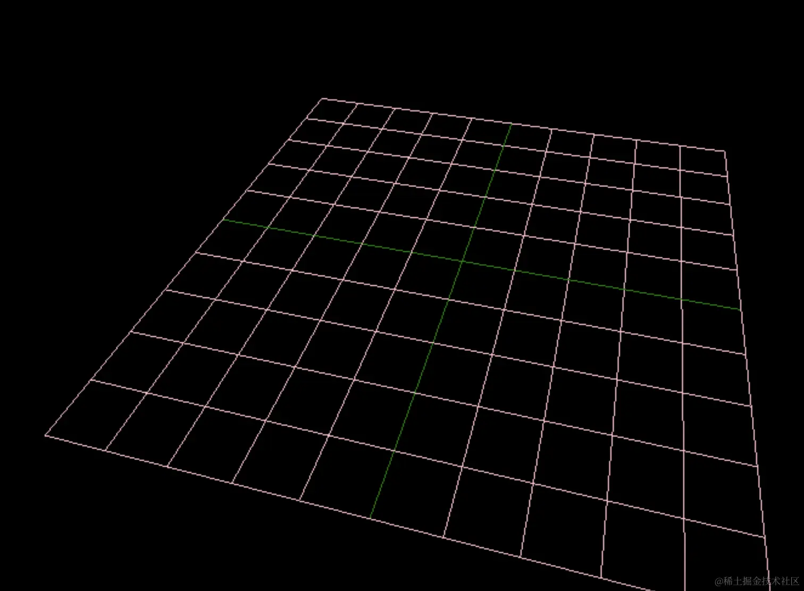

# GridHelper 坐标格辅助对象

## 概述

+ 在二维坐标系中画网格

## 构造函数

+ `GridHelper( size : number, divisions : Number, colorCenterLine : Color, colorGrid : Color )`
  + `size` -- 坐标格尺寸. 默认为 10
  + `divisions` -- 坐标格细分次数. 默认为 10（使用默认值时，会创建一个10*10的网格）
  + `colorCenterLine` -- 中线颜色. 值可以为 Color 类型, 16进制 和 CSS 颜色名. 默认为 0x444444
  + `colorGrid` -- 坐标格网格线颜色. 值可以为 Color 类型, 16进制 和 CSS 颜色名. 默认为 0x888888

  ```js
  // 添加一个辅助网格地面
  const gridHelper = new THREE.GridHelper(300, 25, 0x004444, 0x004444);

  scene.add( gridHelper );
  ```

  
