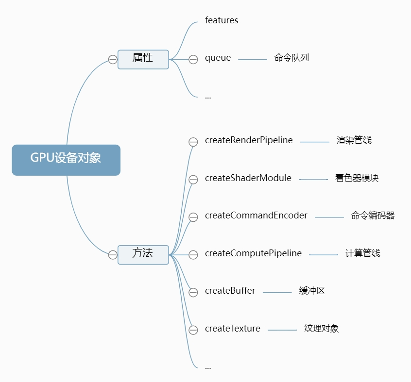

# GPU

## 概述

+ 所谓GPU就是图形处理器
+ 再具体点说，就是你电脑上的显卡，如果为了追求更好的性能，一般会在电脑上安装独立显卡

## GPU设备对象

+ 创建GPU设备对象device非常简单，执行 `navigator.gpu.requestAdapter()` 和 `adapter.requestDevice()` 两步操作即可完成

+ `.requestAdapter()` 和 `.requestDevice()` 都是异步函数，函数前需要加上es6语法的关键字 `await`

  ```js
  // 浏览器请求GPU适配器
  const adapter = await navigator.gpu.requestAdapter();

  // 获取GPU设备对象，通过GPU设备对象device的WebGPU API可以控制GPU渲染过程
  const device = await adapter.requestDevice();
  ```

+ 浏览器控制台测试查看，适配器对象adapter和GPU设备对象device对象的一些属性和方法

  ```js
  console.log('适配器adapter',adapter);

  console.log('GPU设备对象device',device);
  ```

## GPU设备对象device的属性和方法

+ 助GPU设备对象device提供的很多属性和方法，这些属性和方法都是WebGPU API的一部分

  ```js
  device.createRenderPipeline()//创建渲染管线
  device.createComputePipeline()//创建计算管线
  device.createShaderModule()//创建着色器模块
  device.createCommandEncoder()//创建命令对象(绘制和计算命令)
  device.createBuffer()//创建缓冲区对象
  // ...
  ```

  
