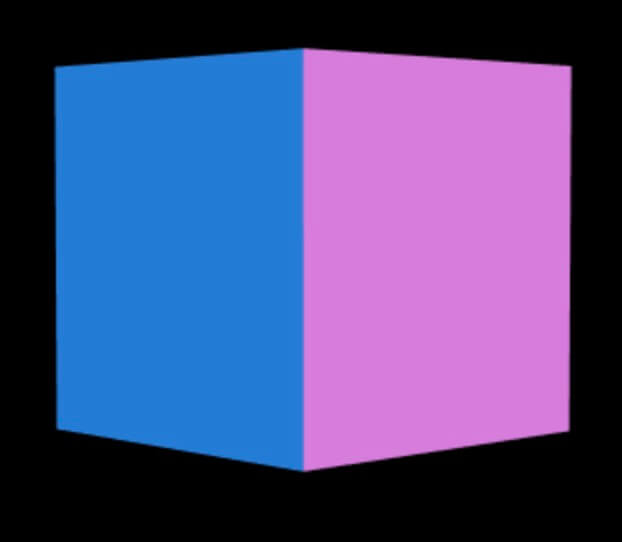

# 五彩缤纷 MeshNormalMaterial

## 概述

+ MeshNormalMaterial是一种五彩缤纷的材质，它的每一个面的颜色由法向量来决定，用法和MeshBasicMaterial一模一样

  ```js
  var geometry = new THREE.BoxGeometry(10, 10, 10,3, 3, 3);
  var material = new THREE.MeshNormalMaterial({
    color: '#ff0000',
  });
  mesh = new THREE.Mesh(geometry, material);
  scene.add(mesh);
  ```

+ 虽然设置了颜色，但是可以看到它的颜色并不是由color属性来决定的，运行结果如下：

  
