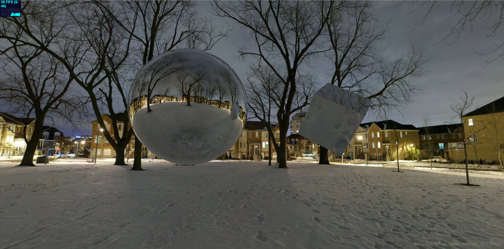

# 立方相机 CubeCamera

## 概述

+ 与透视和正交的作用都不同，它更像是给模型添加相机，将周围的场景通过CubeCamera相机获取到，然后作为物体的贴图，并实时随着场景的变化而变化

+ CubeCamera 有6个渲染，分别是立方体的6个面

+ 它用于生成环境贴图（Environment Maps）或反射贴图（Reflection Maps），能够捕捉场景周围的全景图像

+ THREE.CubeCamera 会在每个渲染帧自动渲染六个方向（前、后、左、右、上、下）的场景视图，并将这些视图拼接成一个立方体贴图（Cube Map）

  

+ 使用过程要添加相机的，因为CubeCamera并不是作为传统相机使用的，所以**传统相机**还是需要添加的

## 应用场景

+ 反射贴图 - 用于模拟物体表面的反射效果，例如镜子或金属表面
+ 环境贴图 - 用于模拟环境光照，使物体看起来像是在一个更大的环境中而不是孤立存在
+ 天空盒 - 用立方体贴图作为背景，营造出天空或环境的感觉

## 构造函数

+ `new THREE.CubeCamera( near, far, [renderTarget] )`

  + near - 靠近摄像机的裁剪平面的距离
  + far - 远处的裁剪平面的距离
  + renderTarget (可选) - 一个 THREE.WebGLCubeRenderTarget 对象，用于存储立方体贴图的数据

  ```js
  // 创建一个立方体摄像机
  var cubeCamera = new THREE.CubeCamera(1, 10000, new THREE.WebGLCubeRenderTarget(256));

  // 添加到场景
  var scene = new THREE.Scene();
  scene.add(cubeCamera);
  ```

## 属性

+ near 和 far - 这两个属性定义了裁剪平面的距离
+ renderTarget - 用于存储立方体贴图的 WebGLCubeRenderTarget 对象
+ update - 一个布尔值，用于指示是否需要在下一帧更新立方体贴图
+ texture - 一个 THREE.CubeTexture 对象，包含了立方体贴图的数据

## 方式

+ updateCubeMap(renderer, scene) - 在渲染场景之前调用此方法来更新立方体贴图。这需要传入渲染器和场景作为参数
+ dispose() - 清理立方体贴图相关的资源

  ```js
  // 更新立方体贴图
  function render() {
    requestAnimationFrame(render);

    // 更新立方体贴图
    if (cubeCamera.update) {
        cubeCamera.updateCubeMap(renderer, scene);
    }

    renderer.render(scene, camera);
  }
  render();
  ```

## 注意事项

+ 立方体贴图的质量取决于立方体摄像机的分辨率以及更新频率。较高的分辨率意味着更好的细节，但也意味着更高的性能开销
+ 当使用立方体贴图进行反射计算时，确保物体的材质支持立方体贴图（例如 THREE.MeshStandardMaterial 支持环境贴图）
+ 立方体贴图更新可能会导致每帧的渲染时间增加，因此应谨慎考虑何时以及如何更新立方体贴图

## 示例

+ 示例

  

  ```js
  // 创建一个WebGLCubeRenderTarget渲染器，并将渲染器作为CubeCamera的参数添加到CubeCamera中
  // WebGLCubeRenderTarget可以理解为将周围的场景获取到做成贴图的功能
  const cubeRenderTarget = new THREE.WebGLCubeRenderTarget( 128, { generateMipmaps: true, minFilter: THREE.LinearMipmapLinearFilter } );
  this.cubeCamera = new THREE.CubeCamera( 1, 100000, cubeRenderTarget );
  this.scene.add( this.cubeCamera );

  // 创建球体后，将刚才的WebGLCubeRenderTarget中的贴图属性作为球体的材质贴图，然后将球体添加到场景中
  const sphere = new THREE.SphereGeometry(1, 32, 32);
  const chromeMaterial = new THREE.MeshLambertMaterial( { color: 0xffffff, envMap: cubeRenderTarget.texture } );
  this.car = new THREE.Mesh( sphere, chromeMaterial );
  this.scene.add( this.car );

  // 如果场景更新需要实时更新，因此还需要做实时渲染功能
  initAnimate() {
    requestAnimationFrame(this.initAnimate);
    this.renderer.render(this.scene, this.camera);
    if(this.cubeCamera){// 更新 CubeCamera
      this.cubeCamera.position.copy( this.car.position );
      this.cubeCamera.update( this.renderer, this.scene );
    }
  }
  ```
