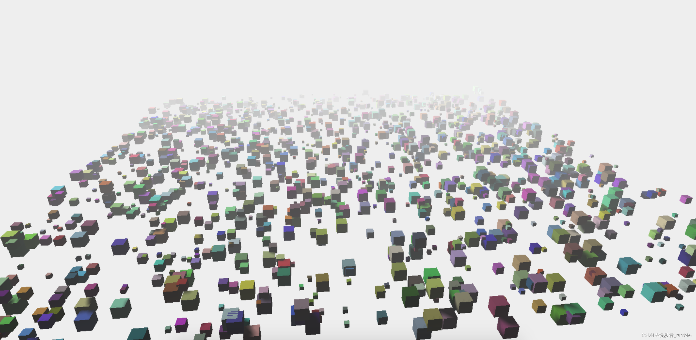

# 基础

## 应用场景

+ 户外场景：在模拟自然景观时，雾可以让远处的山峦或树木显得更加真实
+ 室内场景：在大型室内环境中，雾可以增加空间感，使场景看起来更加深远
+ 游戏开发：在游戏中，雾不仅可以增加视觉效果，还可以用来隐藏远处的细节，减少渲染负担

  

## 注意事项

+ 性能影响：虽然雾效可以增加场景的真实感，但也会对性能产生一定的影响。在大型场景或高性能要求的应用中，需要注意平衡视觉效果和性能

+ 兼容性：雾效在所有现代浏览器中都应该是可用的，但为了确保最佳的兼容性，最好测试一下不同设备和浏览器下的效果
