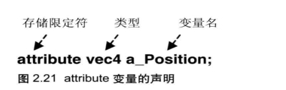

# attribute 变量

## 概述

+ `attribute` 它表示接下来的变量是一个 `attribute` 变量
+ `attribute` 变量必须声明成*全局变量*，数据将从着色器外部传给该变量

+ `attribute` 变量传输的是那些与*顶点相关*的数据

+ `attribute` 变量是一种 GLSL ES 变量，被用来从外部向顶点着色器内传输数据，只有*顶点着色器*能使用它

## 语法

+ <存储限定符> <类型> < 变量名>

  ```js
  attribute vec4 a_Position;

  void main () {
    gl_Position = a_Position;
    gl_PointSize = 10.0;
  }
  ```

  + 参数

    + `attribute` : 是存储限定符，是专门用于向外部到处与点相关对象的，这*类似*于 ES6 中的 `export`
    + vec4 变量类型， `vec4` 是4维矢量对象
    + a_Position 是变量名，之后在js中会根据这个变量名导入变量

      + 这个变量是一个指针，只想实际数据的存储位置
      + 也就是说我们如果在着色器外部改变了 `a_Position` 所指向的实际数据，那么在用着色器中 `a_Position` 所对应的数据也会修改

  

+ 约定：所有的 `attribute` 变量都以 `a_` 前缀开始

  ```js
  // attribute 变量的声明
  // 存储限定符号 - 类型 - 变量名
  attribute vec4 a_Position
  ```
