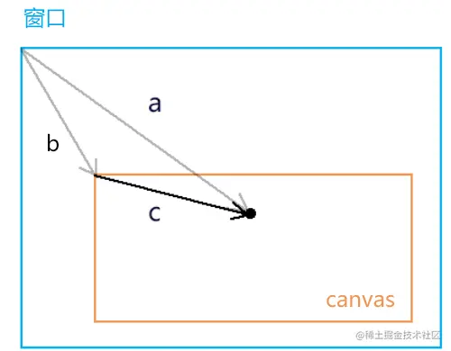

# 获取鼠标点在 webgl 坐标系中的位置

## 概述

+ 对于鼠标点在webgl 坐标系中的位置，我们是无法直接获取的
+ 所以我们得先获取鼠标在canvas 这个DOM元素中的位置

## 获取鼠标在canvas 画布中的css 位置

+ 获取鼠标在canvas 画布中的css 位置

  ```js
  canvas.addEventListener('click',function(event){
    const {clientX,clientY}=event;
    const {left,top}=canvas.getBoundingClientRect();
    const [cssX,cssY]=[
      clientX-left,
      clientY-top
    ];
  })
  ```

  

## canvas 坐标系转 webgl 坐标系

+ 步骤1：解决坐标原点位置的差异

  + `[halfWidth,halfHeight]` 是canvas 画布中心的位置
  + `[xBaseCenter,yBaseCenter]` 是用鼠标位减去canvas 画布的中心位，得到的就是鼠标基于画布中心的位置

  ```js
  const [halfWidth,halfHeight]=[width/2,height/2];
  const [xBaseCenter,yBaseCenter]=[cssX-halfWidth,cssY-halfHeight];
  ```

+ 步骤2：解决y 方向的差异(因为 webgl 里的 y 轴和 canvas 2d 里的y轴相反，所以咱们对 yBaseCenter 值取一下反即可)

  ```js
  const yBaseCenterTop = -yBaseCenter;
  ```

+ 步骤3：解决坐标基底的差异

  + 由于canvas 2d 的坐标基底中的两个分量分别是一个像素的宽高，而webgl的坐标基底的两个分量是画布的宽高，所以咱们得求个比值

  ```js
  const [x,y]=[xBaseCenter/halfWidth,yBaseCenterTop/halfHeight]
  ```

+ 整体代码

  ```js
  canvas.addEventListener('click',function(event){
    const {clientX,clientY} = event;
    const {left,top,width,height} = canvas.getBoundingClientRect();
    const [cssX,cssY]=[
      clientX-left,
      clientY-top
    ];
    const [halfWidth,halfHeight] = [width/2,height/2];
    const [xBaseCenter,yBaseCenter] = [cssX-halfWidth,cssY-halfHeight];
    const yBaseCenterTop =- yBaseCenter;
    const [x,y] = [xBaseCenter / halfWidth, yBaseCenterTop / halfHeight];
  })
  ```

