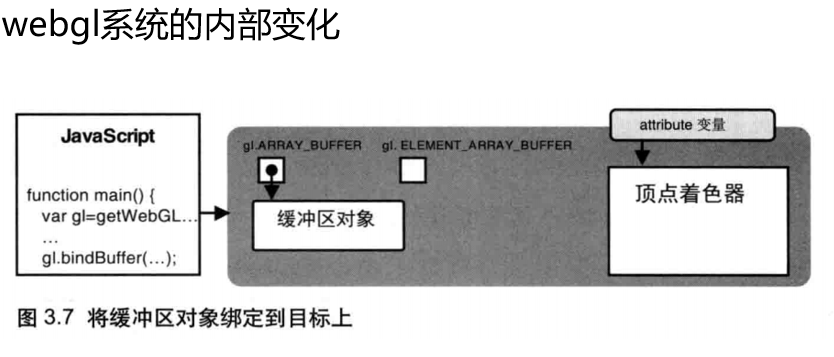

# 将缓冲区对象绑定到webgl系统中的目标上

## 概述

+ `gl.bindBuffer(target, buffer)` 允许使用 `buffer` 表示的缓冲区对象，并将其绑定到 `target` 表示的目标上

  + 参数

    + `target` 参数可以是以下中的一个

      + `gl.ARRAY_BUFFER` 表示缓冲区对象中包含了顶点的数据
      + `gl.ELEMENT_` 表示缓冲区对象中包含了顶点的索引
      + `ARRAY_BUFFER` `OpenGL ES` 着色器语言

    + `buffer` 指定之前由 `gl.createBuffer()` 返回的待绑定的缓冲区对象

  + 返回值 无

+ 错误

  + `INVALLD_ENUM` target 不是上述值之一，这时将保持原有的绑定情况不变

  
