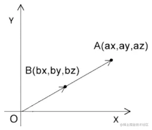

# 基础

## 概述

+ 缩放可以理解为对向量长度的改变，或者对向量坐标分量的同步缩放

  

+ 已知

  + 点A的位置是(ax,ay,az)
  + 点A基于原点內缩了一半

+ 点A內缩了一半后的bx、by、bz位置

+ 解

  ```js
  bx=ax*0.5
  by=ay*0.5
  bz=az*0.5
  ```

## 在着色器中缩放

+ 我可以对gl_Position 的x、y、z依次缩放

  ```html
  <script id="vertexShader" type="x-shader/x-vertex">
    attribute vec4 a_Position;
    float scale=1.2;
    void main(){
        gl_Position.x= a_Position.x*scale;
        gl_Position.y= a_Position.y*scale;
        gl_Position.z= a_Position.z*scale;
        gl_Position.w=1.0;
    }
  </script>
  ```

+ 也可以从a_Position中抽离出由x、y、z组成的三维向量，对其进行一次性缩放

  ```html
  <script id="vertexShader" type="x-shader/x-vertex">
    attribute vec4 a_Position;
    float scale=1.2;
    void main(){
        gl_Position=vec4(vec3(a_Position)*scale,1.0);
    }
  </script>
  ```

## 用js缩放图形

+ 同样的我们也可以把缩放系数暴露给js，通过js 缩放图形

+ 步骤1 建立uniform变量

  ```html
  <script id="vertexShader" type="x-shader/x-vertex">
      attribute vec4 a_Position;
      uniform float u_Scale;
      void main(){
          gl_Position=vec4(vec3(a_Position)*u_Scale,1.0);
      }
  </script>
  ```

+ 步骤2 使用js获取并修改uniform 变量

  ```js
  const u_Scale = gl.getUniformLocation(gl.program, 'u_Scale')
  gl.uniform1f(u_Scale, 1.0)
  ```

+ 步骤3 动画

  ```js
  let angle = 0
  !(function ani() {
      angle += 0.05
      const scale = Math.sin(n) + 1
      gl.uniform1f(u_Scale, scale)
      gl.clear(gl.COLOR_BUFFER_BIT);
      gl.drawArrays(gl.TRIANGLES, 0, 3);
      requestAnimationFrame(ani)
  })()
  ```

  
