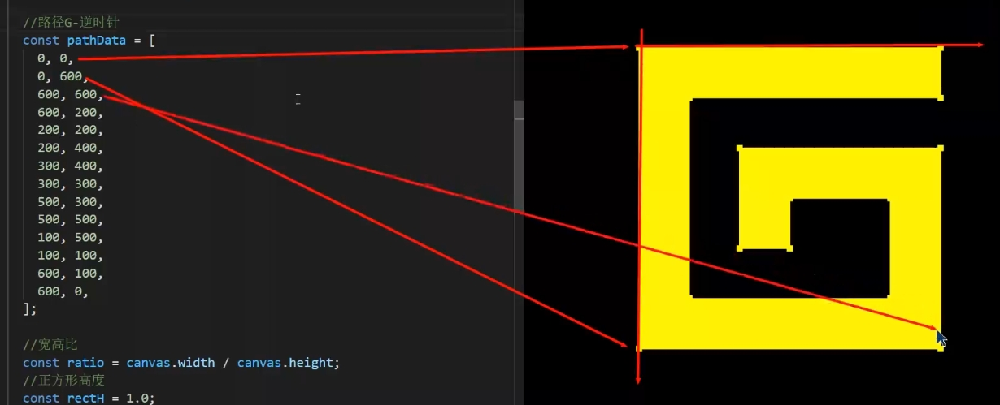
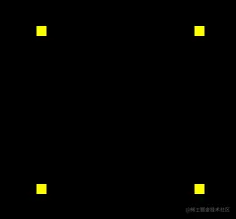
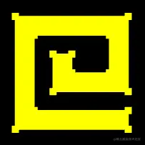

# 示例-绘制路径G

## 概述

+ 显示效果

  

## 步骤1 路径G的顶点数据

+ 路径G的顶点数据

  ```js
  const pathData = [
    0, 0,
    0, 600,
    600, 600,
    600, 200,
    200, 200,
    200, 400,
    300, 400,
    300, 300,
    500, 300,
    500, 500,
    100, 500,
    100, 100,
    600, 100,
    600, 0
  ];
  ```

  

+ 在pathData里两个数字为一组，分别代表顶点的ｘ位和ｙ位。

+ pathData里的数据是我以像素为单位画出来的，在实际项目协作中，UI给我们的svg文件可能也是以像素为单位画出来的，这个我们要做好心理准备
+ 因为，webgl画布的宽和高永远都是两个单位。
+ 所以，我们要将上面的点画到webgl 画布中，就需要做一个数据映射

## 步骤2 在webgl 中绘制正方形

+ 从pathData 数据中我们可以看出，路径G的宽高都是600，是一个正方形

+ 所以，我可以将路径G映射到webgl 画布的一个正方形中

+ 这个正方形的高度我可以暂且定为1，那么其宽度就应该是高度除以canvas画布的宽高比

  ```js
  //宽高比
  const ratio = canvas.width / canvas.height;
  //正方形高度
  const rectH = 1.0;
  //正方形宽度
  const rectW = rectH / ratio;
  ```

## 步骤3 正方形的定位，把正方形放在webgl画布的中心

+ 获取正方形尺寸的一半，然后求出其x、y方向的两个极值即可

  ```js
  //正方形宽高的一半
  const [halfRectW, halfRectH] = [rectW / 2, rectH / 2];
  //两个极点
  const minX = -halfRectW;
  const minY = -halfRectH;
  const maxX = halfRectW;
  const maxY = halfRectH;

  ```

## 步骤4 绘制正方形

+ 利用之前的Poly对象绘制正方形，测试一下效果

  ```js
  const rect = new Poly({
    gl,
    vertices: [
        minX, maxY,
        minX, minY,
        maxX, minY,
        maxX, maxY,
    ],
  });
  rect.draw();
  ```

  

## 步骤5 建立x轴和y轴比例尺

+ 建立x轴和y轴比例尺

  ```js
  const scaleX = ScaleLinear(0, minX, 600, maxX);
  const scaleY = ScaleLinear(0, minY, 600, maxY);
  function ScaleLinear(ax, ay, bx, by) {
    const delta = {
      x: bx - ax,
      y: by - ay,
    };
    const k = delta.y / delta.x;
    const b = ay - ax * k;
    return function (x) {
      return k * x + b;
    };
  }
  ```

+ `ScaleLinear(ax, ay, bx, by)` 方法使用的就是点斜式，用于将x轴和y轴上的数据像素数据映射成 webgl数据

  + ax 像素数据的极小值
  + ay webgl数据的极小值
  + bx 像素数据的极大值
  + by webgl数据的极大值

## 步骤5 将路径G中的像素数据解析为webgl 数据

+ 将路径G中的像素数据解析为webgl 数据

  ```js
  const glData = [];
  for (let i = 0; i < pathData.length; i += 2) {
      glData.push(scaleX(pathData[i]), scaleY(pathData[i + 1]));
  }
  ```

  ```js
  const path = new Poly({
    gl,
    vertices: glData,
    types: ["POINTS", "LINE_LOOP"],
  });
  path.draw();
  ```

## 步骤6 将图形网格化

+ 步骤1 建立了一个ShapeGeo 对象，用于将图形网格化

  ```js
  const shapeGeo = new ShapeGeo(glData)
  ```

  + 属性

    + pathData 平展开的路径数据
    + geoData 由路径数据pathData 转成的对象型数组
    + triangles 三角形集合，对象型数组
    + vertices 平展开的对立三角形顶点集合

  + 方法

    + update() 更新方法，基于pathData 生成vertices
    + parsePath() 基于路径数据pathData 转成对象型数组
    + findTriangle(i) 寻找符合条件的三角形

      + i 顶点在geoData 中的索引位置，表示从哪里开始寻找三角形

    + includePoint(triangle) 判断三角形中是否有其它顶点
    + inTriangle(p0, triangle) 判断一个顶点是否在三角形中
    + cross([p0, p1, p2]) 以p0为基点，对二维向量p0p1、p0p2做叉乘运算
    + upadateVertices() 基于对象数组geoData 生成平展开的vertices 数据

+ 步骤2 绘制G形面

  ```js
  const face = new Poly({
    gl,
    vertices: shapeGeo.vertices,
    types: ["TRIANGLES"],
  });
  face.draw();
  ```

  


