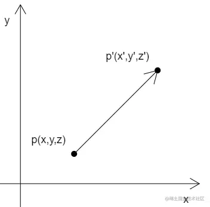

# 基础

## 概述

+ 对图形的平移就是对图形所有顶点的平移

## 示例

+ 已知

  + 顶点p(x,y,z)
  + 在x、y、z 三个方向上，分别将点p 移动tx、ty、tz

+ 求：点p 移动后的位置p'(x',y',z')

  

+ 解

  ```js
  x' = x + tx
  y' = y + ty
  z' = z + tz
  ```

+ 如果这个图形中并非只有一个顶点，而是有三个，或者更多，那么所有的顶点也是按照同样原理进行位移

  

## 向量加法

+ 在实际代码中，我们要有一个向量的概念

  + 比如 (x,y,z) ，我们既可以说它是一个顶点位置，也可以说它是一个向量

+ 至于 (x,y,z) 到底是什么，要看我们拿它做什么
+ 比如，把点p(x,y,z) 作为点位时，那它就是点p(x,y,z)
+ 我们把p 的移动距离tx、ty、tz 封装成一个对象pt(tx,ty,tz)，那么pt 就是一个向量，一个为点p 指明移动方向和距离的向量

+ 因此：点p 的移动结果 p' 就可以这么写

  ```js
  p' = p + pt
  ```

+ 顶点的位移就是向量的加法
