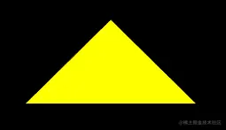
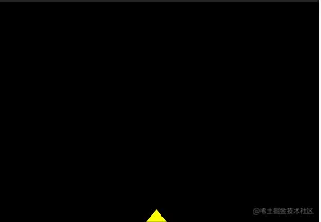

# 代码实现

## 方式1 GLSL ES 语言里的向量运算

+ 在GLSL ES 语言里，是可以直接进行向量运算
+ 下面的顶点着色器里的代码

  ```js
  attribute vec4 a_Position;
  vec4 translation=vec4(0,0.2,0,0);
  void main(){
      gl_Position = a_Position+translation;
  }
  ```

  + `a_Position` 是原始点位，属于 `attribute` 变量
  + `translation` 是顶点着色器里的私有变量，没有向外部暴露，属于4维向量
  + `a_Position` + `translation` 便是着色器内的向量加法，这里是对原始点位进行位移

## 方式2 js修改

+ 我们也可以把 translation 变量暴露出去，让js可以修改图形位置

  ```html
  <script id="vertexShader" type="x-shader/x-vertex">
      attribute vec4 a_Position;
      uniform vec4 u_Translation;
      void main(){
          gl_Position = a_Position+u_Translation;
      }
  </script>
  ```

+ 在js 中修改uniform 变量的方法

  ```js
  const u_Translation=gl.getUniformLocation(gl.program,'u_Translation');
  gl.uniform4f(u_Translation,0,0.5,0,0);
  ```

+ 整体代码

  ```js
  <canvas id="canvas"></canvas>
  <script id="vertexShader" type="x-shader/x-vertex">
      attribute vec4 a_Position;
      uniform vec4 u_Translation;
      void main(){
          gl_Position = a_Position+u_Translation;
      }
  </script>
  <script id="fragmentShader" type="x-shader/x-fragment">
      void main(){
          gl_FragColor=vec4(1,1,0,1);
      }
  </script>
  <script type="module">
      import {initShaders} from './utils.js';

      const canvas = document.getElementById('canvas');
      canvas.width=window.innerWidth;
      canvas.height=window.innerHeight;
      const gl = canvas.getContext('webgl');

      const vsSource = document.getElementById('vertexShader').innerText;
      const fsSource = document.getElementById('fragmentShader').innerText;
      initShaders(gl, vsSource, fsSource);

      const vertices=new Float32Array([
          0,  0.1,
          -0.1,-0.1,
          0.1, -0.1
      ])

      const vertexBuffer=gl.createBuffer();
      gl.bindBuffer(gl.ARRAY_BUFFER,vertexBuffer);
      gl.bufferData(gl.ARRAY_BUFFER,vertices,gl.STATIC_DRAW);
      const a_Position=gl.getAttribLocation(gl.program,'a_Position');
      gl.vertexAttribPointer(a_Position,2,gl.FLOAT,false,0,0);
      gl.enableVertexAttribArray(a_Position);

      const u_Translation=gl.getUniformLocation(gl.program,'u_Translation');
      gl.uniform4f(u_Translation,0,0.5,0,0);

      gl.clearColor(0, 0, 0, 1);
      gl.clear(gl.COLOR_BUFFER_BIT);

      // gl.drawArrays(gl.POINTS, 0, 3);
      gl.drawArrays(gl.TRIANGLES, 0, 3);
  </script>
  ```

  

+ 可以加一段逐帧动画

  ```js
  let y=0;
  !(function ani(){
      y+=0.02
      if(y>1){
          y=-1
      }
      gl.uniform4f(u_Translation,0,y,0,0);
      gl.clear(gl.COLOR_BUFFER_BIT);
      gl.drawArrays(gl.TRIANGLES, 0, 3);
      requestAnimationFrame(ani)
  })()
  ```

  

