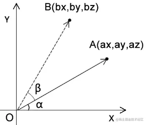

# 旋转公式

## 概述

+ 让顶点围绕 z 轴旋转的例子

  

+ 已知

  + 点A的位置是(ax,ay,az)
  + 点A要围绕z轴旋转β度，转到点B的位置

+ 求：点A旋转后的bx、by位置

+ 解：

  + 因为∠β是已知的，∠α 可以通过点A 得出

    ```js
    ∠xOB=α+β
    ```

  + 通过三角函数就可以推出bx、by

    ```js
    bx=cosθ*|OA|
    by=sinθ*|OA|

    // |OA|是点O到点A的距离，可以直接用点A求出
    |OA|=Math.sqrt(ax*ax+ay*ay)

    // 利用和角公式求cosθ和sinθ的值：
    cosθ=cos(α+β)
    cosθ=cosα*cosβ-sinα*sinβ

    sinθ=sin(α+β)
    sinθ=cosβ*sinα+sinβ*cosα
    ```

  + bx、by

    ```js
    bx=ax*cosβ-ay*sinβ
    by=ay*cosβ+ax*sinβ
    ```


