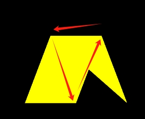
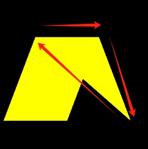

# 三角扇

## 概述

+ 三角扇 `gl.TRIANGLE_FAN`

+ 对于顶点【v1, v2, v3, v4, v5, v6】六个顶点绘制一个三角扇图形

  

+ 绘制三角形的数量 = 顶点数 - 2

## 绘制顺序

+ v0>v1>v2

  
​
+ v0>v2>v3 以上一个三角形的第三条边+下一个点为基础，按照和第三条边相反的顺序，绘制三角形

+ v0>v3>v4 以上一个三角形的第三条边+下一个点为基础，按照和第三条边相反的顺序，绘制三角形
​
+ v0>v4>v5 以上一个三角形的第三条边+下一个点为基础，按照和第三条边相反的顺序，绘制三角形

+ 示例

  
  
  
  
