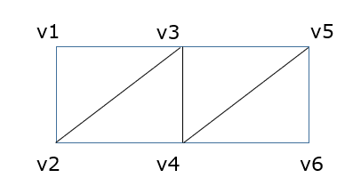
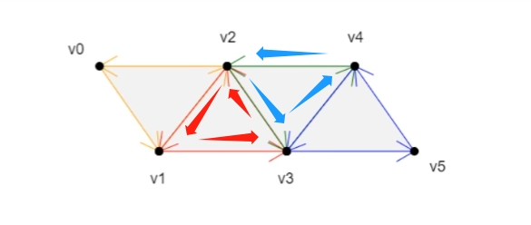
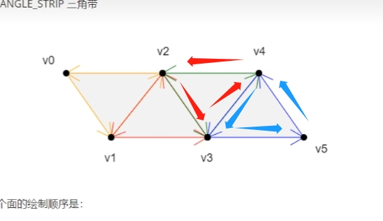

# 三角带

## 概述

+ 三角带 `gl.TRIANGLE_STRIP`

+ 对于顶点【v1, v2, v3, v4, v5, v6】六个顶点绘制一个三角带图形

  

+ 绘制三角形数量 = 顶点数 - 2

## 绘制顺序

+ v0>v1>v2 以上一个三角形的第二条边+下一个点为基础，以和第二条边相反的方向绘制三角形

  

+ v2>v1>v3 以上一个三角形的第三条边+下一个点为基础，以和第二条边相反的方向绘制三角形

  

+ v2>v3>v4 以上一个三角形的第二条边+下一个点为基础，以和第二条边相反的方向绘制三角形

  

+ v4>v3>v5

+ 规律：

  + 第一个三角形：v0>v1>v2
  + 第偶数个三角形：以上一个三角形的第二条边+下一个点为基础，以和第二条边相反的方向绘制三角形
  + 第奇数个三角形：以上一个三角形的第三条边+下一个点为基础，以和第二条边相反的方向绘制三角形

  
